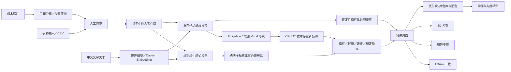
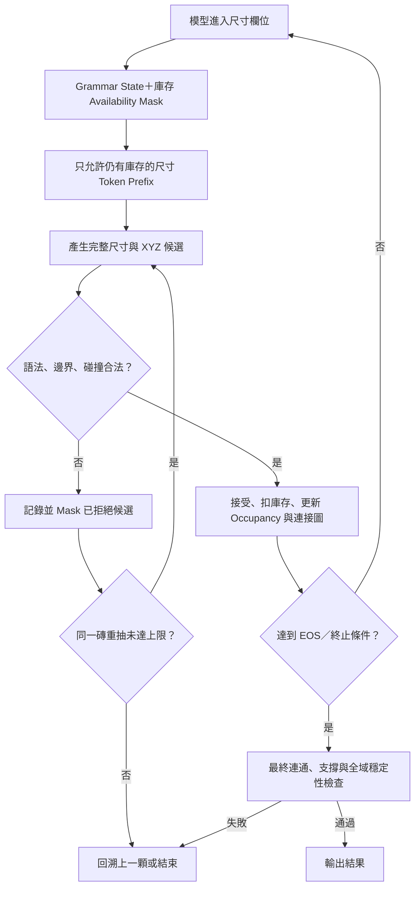

# BrickAgain 專題工作流程與交接文件

> 本文件是 BrickAgain 專題的主要規劃文件，供專題本人與其他協作者閱讀與接手。
>
> 執行時請依照「功能相依關係」與「完成條件」前進，不使用週次、期限或固定工時規劃。完成一項後再勾選對應核取方塊，並在「目前進度」留下簡短紀錄。
>
> 本版已整合前期可行性審查，核心範圍限縮為 StableText2Brick 的 8 種基本磚，並加入反事實 re-tiling、動態庫存約束解碼、A～E 與 F 系列 Baseline，以及正式的實驗壓力測試定義。

## 1. 專題摘要

### 專題名稱

中文名稱：

> BrickAgain：結合積木辨識、有限庫存約束與生成式模型的 LEGO 再創作系統

英文名稱：

> BrickAgain: An Inventory-Constrained Generative Brick Building System

### 核心構想

使用者把組裝完成後剩餘的基本積木拍照或手動輸入系統，系統辨識零件種類、顏色與數量，建立個人零件庫。使用者可以用自然語言描述想組的東西，系統接著：

1. 從既有作品庫尋找能完整組裝或接近能組裝的作品。
2. 如果沒有適合的既有作品，使用生成式模型逐顆產生新的積木結構。
3. 生成時嚴格限制不能使用超出庫存的零件種類與數量。
4. 檢查位置、碰撞、連接關係與基本穩定性。
5. 先生成無色結構，再依照實際「形狀 × 顏色」庫存做獨立配色。
6. 輸出零件表、剩餘庫存、3D 預覽、LDraw 模型與組裝順序。

### 核心研究問題

> 在使用者只有有限種類與數量的 8 種基本積木時，庫存條件微調與硬性約束解碼能否生成不超出庫存、沒有碰撞、最終連通、具基本穩定性且符合文字需求的作品？相較於「檢索形狀後再用 CP-SAT 鋪磚」的兩階段方法，各自有什麼優缺點？

### 專題主要貢獻

本專題不是重新製作一般的文字轉 LEGO 模型，而是把「剩餘零件庫存」加入生成條件。主要貢獻應包含：

- 把照片辨識結果轉成正規化的基本磚庫存，將旋轉後的 `1x4`／`4x1` 視為同一零件種類。
- 建立既有作品的精確與近似庫存比對。
- 建立 `文字需求 + 有限庫存 -> 積木生成序列` 的資料格式。
- 建立有限庫存下的 CP-SAT re-tiling 反事實資料，使相同物體與文字能對應不同庫存和不同合法結構。
- 使用 LoRA／QLoRA 微調小型生成模型，使其學習考慮庫存。
- 實作語法、動態庫存、碰撞、最終連通與穩定性驗證器。
- 比較原始模型、Prompt 約束、Inventory LoRA、硬限制，以及檢索加最佳化的兩階段方法。
- 在庫存鬆緊、干擾零件與指定零件剔除三種條件下，評估合規、成功率、語意品質與生成成本。
- 將生成結果輸出成可以檢視與後續組裝的 LDraw 格式，而不只是生成一張圖片。

## 2. 不可違背的專題決策

後續協作者開始工作前，必須先理解以下決策：

1. **不等待 BrickNet 完整資料才開始。**
   - BrickNet 完整資料已提出申請，但沒有核准與等待時間保證。
   - 公開資料與公開模型必須足以完成主要專題。

2. **核心只採 StableText2Brick／BrickGPT 的 8 種基本長方形積木。**
   - 8 種正規零件為：1x1、1x2、1x4、1x6、1x8、2x2、2x4、2x6。
   - `4x1`、`8x1`、`4x2` 等只是旋轉表示，必須共用正規零件的庫存計數器。
   - BrickNet／LDraw 真實零件 Graph 是延伸軌，不得阻擋核心成果。

3. **不從零訓練大型語言模型。**
   - 使用公開預訓練模型作為 Baseline。
   - 自行進行 LoRA／QLoRA 微調，以符合課程中的模型訓練實作。

4. **微調不能取代硬性驗證。**
   - 模型學會遵守庫存只代表違規率降低。
   - 最終輸出必須由程式保證庫存違規率為 0%。

5. **生成的主要輸出是結構資料，不是圖片。**
   - 必須包含零件、位置、旋轉與組裝順序。
   - 最終至少能輸出 `.ldr` 或等價的結構化模型。

6. **圖片辨識一定保留人工修正。**
   - 真實拍攝受角度、光線、遮擋影響，不應假設辨識百分之百正確。

7. **RAG 不負責判斷可不可組。**
   - RAG 負責理解需求、檢索作品與解釋結果。
   - 零件是否足夠由確定性的庫存比對程式判定。

8. **StableText2Brick 的顏色不進入結構生成訓練。**
   - 原資料沒有顏色監督訊號。
   - 先生成無色結構，再用確定性指派演算法分配現有顏色。

9. **所有資料切分與檢索評估都以 `object_id` 隔離。**
   - 同一 `object_id` 的所有結構與 caption 必須位於同一 Split。
   - F-pipeline 的檢索索引只能包含 Train Split。

10. **先驗證最高風險，再做 UI、視覺與延伸功能。**
    - 第一個技術動作是讓 BrickGPT 在可用環境完成一次推論與 `.ldr` 匯出。
    - 接著做資料 EDA、CP-SAT re-tiling Benchmark 與約 2,000 筆的小型 QLoRA 煙霧測試。

## 3. 功能範圍

### 3.1 必做核心功能

- [ ] 手動新增、修改與刪除零件。
- [ ] 輸入零件形狀、顏色與數量。
- [ ] CSV／JSON 零件庫存匯入與匯出。
- [ ] 從既有作品庫推薦完全可組作品。
- [ ] 推薦接近可組作品並列出缺件。
- [ ] 中文自然語言需求輸入。
- [ ] Caption Embedding／語意搜尋既有作品。
- [ ] 文字與有限庫存條件的逐顆生成。
- [ ] 硬性庫存數量限制。
- [ ] 空間邊界與碰撞檢查。
- [ ] 局部 stud 連接圖、最終連通性與基本支撐檢查。
- [ ] 生成失敗時的重試或回溯。
- [ ] CP-SAT re-tiling 反事實資料生成器。
- [ ] Retrieval + CP-SAT 的兩階段 Baseline。
- [ ] 無色結構的庫存合法配色後處理。
- [ ] 3D 預覽或逐步渲染。
- [ ] 零件表、使用量與剩餘量。
- [ ] LDraw 輸出。
- [ ] A～E 與 F 系列的實驗比較。

### 3.2 第二優先功能

- [ ] 8 種基本磚的傳統 CV Baseline。
- [ ] 8 種基本磚的單顆分類或平鋪多顆偵測與計數。
- [ ] 自己拍攝的真實圖片微調與測試。
- [ ] 圖片辨識結果的人工修正介面。
- [ ] HSV／CIELAB 顏色辨識。
- [ ] 中文條件抽取與有根據的推薦說明。
- [ ] 組裝順序或逐步圖片。

### 3.3 延伸／未來工作

- BrickNet 公開模型的小型推論展示。
- 真實 LDraw 零件與 Graph 連接表示。
- 8 種基本磚以外的完整視覺辨識。
- 更完整的物理穩定性與真實組裝研究。

### 3.4 明確不做的功能

- 不輸入 LEGO 套裝編號來推算理論剩餘零件。
- 不在第一版支援所有 LEGO 零件。
- 不承諾辨識箱子中嚴重堆疊、遮擋的積木。
- 不承諾生成大型或機械結構複雜的作品。
- 不把文生圖結果當成可以實際組裝的模型。
- 不以爬取未授權 MOC 說明書作為主要資料來源。
- 不讓語言模型單獨判定零件是否足夠或結構是否合法。

### 3.5 第一版限制

- 核心生成與圖片辨識都只支援 8 種基本磚。
- 多顆零件必須平鋪並盡量不重疊。
- 每張照片先限制約 3～20 顆積木。
- 生成作品先限制在 20～50 顆積木內。
- 簡化生成先使用 1 單位高的長方體積木。
- 形狀與數量是生成硬限制；顏色由生成後的庫存指派處理。
- 視覺模組若實作，最終測試必須包含自己拍攝的真實照片。

## 4. 系統整體架構



## 5. 核心與延伸生成策略

### 5.1 核心軌：8 種簡化長方形積木

資料與工具：

- StableText2Brick 公開資料。
- BrickGPT 公開程式與模型。
- 20×20×20 Voxel 空間。
- OR-Tools CP-SAT。

目標：

```text
文字描述 + 基本積木庫存
-> 逐顆產生尺寸與 XYZ
-> 庫存驗證
-> Voxel 碰撞／支撐檢查
-> 3D 與 LDraw 輸出
```

優點：

- 資料完全公開。
- 資料量適合課程實驗。
- 容易自己建立庫存條件訓練資料。
- 容易實作碰撞與支撐檢查。

限制：

- 只包含 1 單位高的長方體積木。
- 不含輪子、斜面、鉸鏈、Technic 等特殊零件。
- 只包含有限物體類別。

### 5.2 延伸軌：真實 LDraw／BrickNet 零件

資料與工具：

- BrickNet 公開 Python 套件。
- BrickNet 0.6B PT 與 SFT 模型。
- BrickNet 零件詞彙、連接標籤、別名表。
- BrickNet 碰撞 Mesh。
- LDraw Parts Library。
- LDraw Official Model Repository。
- 若取得核准，再加入完整 BrickNet Graph、Caption 與 Path 資料。

目標：

```text
文字描述 + 真實零件庫存
-> Graph-backed Build Sequence
-> Stud／Hinge／Axle／Ball／Fixed 連接
-> 庫存與碰撞檢查
-> 真實 LDraw 模型
```

延伸原則：

- 先證明公開 0.6B 模型可以完成推論。
- 先支援少量常見真實零件，不直接支援數千種。
- 如果完整資料沒有取得，使用公開模型作 Baseline，LoRA 訓練仍在簡化軌完成。
- 如果完整資料取得，才進行真實零件的庫存條件微調。
- 只有核心軌完成且仍有餘力時，才進入此軌。

## 6. 資料來源

### 6.1 StableText2Brick

網址：<https://huggingface.co/datasets/AvaLovelace/StableText2Brick>

已知內容：

- 約 47,389 筆積木結構。
- 超過 28,000 個不同 3D 物體。
- 每筆含多段英文描述。
- `bricks` 欄位包含積木尺寸及 `(x,y,z)`。
- `stability_scores` 提供 20×20×20 穩定度資料。
- 只含 1 單位高的長方體積木，沒有顏色欄位。
- 正規化後使用 8 種 footprint；原始字串同時包含旋轉形式，例如 `1x4` 與 `4x1`。
- MIT License。
- 類別包含 car、bus、chair、table、tower、train 等。

主要用途：

- 建立簡化作品資料庫。
- 建立庫存條件微調資料。
- 建立同物體自然變體與 CP-SAT re-tiling 反事實資料。
- 訓練文字轉簡化積木生成。
- 評估庫存、碰撞與穩定性。

### 6.2 BrickGPT

網址：<https://github.com/AvaLovelace1/BrickGPT>

論文：

- Ava Pun、Kangle Deng、Ruixuan Liu、Deva Ramanan、Changliu Liu、Jun-Yan Zhu。
- *Generating Physically Stable and Buildable Brick Structures from Text*，ICCV 2025。
- arXiv：<https://arxiv.org/abs/2505.05469>

主要用途（延伸，不列為核心完成條件）：

- 文字轉積木的公開 Baseline。
- LoRA／模型微調流程參考。
- 穩定性、碰撞與 LDraw 輸出參考。
- 驗證 StableText2Brick 的官方資料格式。

### 6.3 BrickNet

專案頁：<https://kulits.github.io/BrickNet/>

套件頁：<https://pypi.org/project/bricknet/>

模型：<https://huggingface.co/collections/kulits/bricknet>

論文：

- Peter Kulits、Cordelia Schmid。
- *BrickNet: Graph-Backed Generative Brick Assembly*，CVPR 2026。
- arXiv：<https://arxiv.org/abs/2604.22984>

主要用途：

- 真實零件的 Graph 表示。
- LDraw 解析與 Graph 轉換。
- Graph 取樣成 Build Tree／Path Text。
- 真實連接語意與碰撞檢查。
- 真實 LEGO 文字條件生成 Baseline。

目前狀態：

- 完整資料已提出申請。
- 公開套件與模型不需等待即可使用。
- 專題不能依賴申請一定通過。

### 6.4 LDraw

零件庫：<https://library.ldraw.org/>

官方模型庫：<https://library.ldraw.org/omr>

格式規格：<https://www.ldraw.org/article/218.html>

主要用途：

- 真實零件 3D 幾何。
- 完整作品的零件、顏色、座標與旋轉。
- `.ldr`、`.dat`、`.mpd` 模型。
- `0 STEP` 組裝步驟資訊（並非每個模型都完整）。

典型 Type 1 格式：

```text
1 <colour> x y z a b c d e f g h i <part-file>
```

其中：

- `colour`：顏色代碼。
- `x y z`：3D 位置。
- `a` 到 `i`：3×3 旋轉／變換矩陣。
- `part-file`：零件檔名或編號。

### 6.5 Rebrickable

API：<https://rebrickable.com/api/>

主要用途：

- 零件編號與名稱。
- 顏色資料。
- 零件圖片。
- 零件關係與外部編號對照。
- Rebrickable、BrickLink、LDraw 編號正規化。

限制：

- 只能提供某作品有哪些零件，不能提供每顆零件的 3D 位置。
- 大量資料應使用官方 CSV Downloads，而非逐筆呼叫 API。

### 6.6 圖片資料

可評估的 Kaggle 來源：

- Images of LEGO Bricks：50 種零件、約 40,000 張合成圖。
- B200 LEGO Detection Dataset：200 種零件、約 800,000 張合成圖。
- Largest LEGO Dataset：600 種零件的合成物件偵測資料。
- Synthetic LEGO Brick Dataset：少量類別，適合先測試 YOLO 流程。

使用原則：

- Kaggle 合成圖用於預訓練與流程驗證。
- 最終測試必須包含自己拍攝的真實圖片。
- 必須檢查每個資料集授權並保留來源資訊。

## 7. 核心資料格式

所有子系統應使用統一格式，避免圖片模型、推薦模型與生成模型各用一套零件命名。

### 7.1 零件主資料

```json
{
  "namespace": "ldraw",
  "part_id": "3001",
  "canonical_part_id": "brick_2x4",
  "part_name": "Brick 2 x 4",
  "category": "Brick",
  "color_id": "4",
  "color_name": "Red",
  "quantity": 6,
  "confidence": 0.94,
  "source": "image_detection"
}
```

`namespace` 建議值：

- `simple_brick`
- `ldraw`
- `rebrickable`
- `bricklink`
- `bricknet`

`source` 建議值：

- `manual`
- `csv`
- `single_image_classification`
- `multi_object_detection`
- `generated`

### 7.2 個人庫存

```json
{
  "inventory_id": "user_001",
  "allow_color_substitution": true,
  "parts": [
    {
      "namespace": "simple_brick",
      "part_id": "brick_1x2",
      "color_id": "red",
      "quantity": 8
    },
    {
      "namespace": "simple_brick",
      "part_id": "brick_2x4",
      "color_id": "blue",
      "quantity": 4
    }
  ]
}
```

### 7.3 生成動作

```json
{
  "step": 5,
  "part_id": "brick_1x2",
  "canonical_part_id": "brick_1x2",
  "raw_size": "2x1",
  "color_id": "red",
  "position": [4, 8, 2],
  "rotation": 90,
  "parent_step": 3,
  "connector_type": "stud",
  "parent_connector": null,
  "child_connector": null
}
```

簡化版本可以暫時沒有 Connector 欄位；真實 BrickNet 版本應保存連接類型與連接點。

### 7.4 完整作品紀錄

```json
{
  "model_id": "generated_001",
  "prompt": "一台小型紅色汽車",
  "initial_inventory": {},
  "used_inventory": {},
  "remaining_inventory": {},
  "steps": [],
  "inventory_valid": true,
  "collision_free": true,
  "connected": true,
  "stable": true,
  "parse_valid": true,
  "termination_reason": "normal_eos",
  "candidate_rejections": 0,
  "brick_retries": 0,
  "previous_brick_backtracks": 0,
  "physics_rollbacks": 0,
  "structural_success": true,
  "semantic_success": true,
  "full_success": true,
  "ldraw_path": "generated_001.ldr"
}
```

### 7.5 圖片辨識結果

```json
{
  "image_id": "photo_001",
  "detections": [
    {
      "bbox": [100, 80, 220, 190],
      "class_id": "brick_1x2",
      "shape_confidence": 0.92,
      "color_id": "red",
      "color_confidence": 0.78,
      "user_corrected": false
    }
  ]
}
```

## 8. 建議專案結構

```text
brickagain/
├── README.md
├── BRICKAGAIN_PROJECT_WORKFLOW.md
├── requirements.txt
├── configs/
│   ├── vision.yaml
│   ├── generation.yaml
│   ├── inventory.yaml
│   └── training.yaml
├── data/
│   ├── raw/
│   ├── interim/
│   ├── processed/
│   ├── samples/
│   └── metadata/
├── notebooks/
│   ├── 01_dataset_eda.ipynb
│   ├── 02_inventory_builder.ipynb
│   ├── 03_retrieval_baseline.ipynb
│   ├── 04_generation_baseline.ipynb
│   ├── 05_retiling_benchmark.ipynb
│   ├── 06_lora_smoke_test.ipynb
│   ├── 07_constraint_evaluation.ipynb
│   └── 08_vision_training.ipynb
├── src/
│   ├── data/
│   ├── inventory/
│   ├── vision/
│   ├── retrieval/
│   ├── generation/
│   ├── constraints/
│   ├── optimization/
│   ├── evaluation/
│   ├── rag/
│   ├── rendering/
│   └── ui/
├── tests/
│   ├── fixtures/
│   ├── test_inventory.py
│   ├── test_parser.py
│   ├── test_part_normalization.py
│   ├── test_collision.py
│   ├── test_connectivity.py
│   ├── test_constrained_decoding.py
│   ├── test_retiling.py
│   ├── test_split_leakage.py
│   └── test_ldraw_export.py
├── artifacts/
│   ├── checkpoints/
│   ├── evaluations/
│   ├── renders/
│   └── ldraw/
└── app.py
```

規則：

- Notebook 用於探索與實驗，不存放唯一可執行版本。
- 可重複使用的程式必須移到 `src/`。
- Raw Data 不進行人工覆寫。
- 大型資料與模型不要直接提交 Git。
- 每次訓練保存 Config、Seed、指標與 Checkpoint 路徑。
- 若取得受限 BrickNet 資料，不得加入公開 Repository 或重新散布。

## 9. 依賴順序與工作流程

以下順序是功能相依關係，不是時間表。可以一次做多項，但在上游資料格式未穩定前，不應過早整合所有功能。

## 9.1 基礎規格與環境

本節的最高優先工作不是先做介面，而是確認核心外部模型能實際執行。預設先使用 M4 Pro／48 GB 本機完成；只有實測發現特定訓練流程在 MPS 不相容、速度不合理或資源不足時，才評估 Kaggle 或其他遠端 GPU。

### 已知開發設備

- MacBook Pro。
- Apple M4 Pro。
- 48 GB Unified Memory。
- 架構為 Apple Silicon `arm64`，不是 NVIDIA CUDA 環境。

### Apple Silicon 執行原則

- 優先安裝原生 `arm64` Python 與套件，避免不必要的 Rosetta／x86 模擬環境。
- 啟動時記錄 `platform`、macOS、Python、PyTorch、Transformers、裝置後端與套件 Lockfile。
- 先檢查 `torch.backends.mps.is_available()`；推論優先測試 `mps`，不支援的 Operator 才評估 CPU fallback。
- 若啟用 `PYTORCH_ENABLE_MPS_FALLBACK=1`，必須在實驗紀錄標記，因為部分運算落到 CPU 會改變速度。
- 使用 PyTorch MPS 記憶體 API 記錄目前配置量與建議上限；不要為了多吃 Unified Memory 關閉保護而造成整台電腦 OOM。
- 48 GB Unified Memory 對 1B 級推論、EDA、Embedding、傳統 CV、CP-SAT 與小型本機測試很有利，但仍須以實測 Peak Memory 為準。
- 不假設 CUDA 專用的 4-bit QLoRA 流程可在 MPS 原樣執行。先比較本機 MPS 的 LoRA、可用量化方案與記憶體／速度；若非量化 LoRA 已可接受，就不必為了使用 QLoRA 搬到 Kaggle。
- Kaggle／遠端 GPU 是可選備案，不是專題必要條件。只有本機實測不適合時才使用，並保存相同模型、資料、Seed 與設定，避免把 MPS／CUDA 差異誤認為模型差異。
- OR-Tools CP-SAT、資料處理、檢索與評估優先留在本機；Gurobi 有 macOS arm64 平台，但仍需完成學術授權與安裝驗證。
- BrickGPT 渲染依賴若在 macOS 發生問題，先以原始文字與 `.ldr` 成功作為推論煙霧測試通過條件，再處理渲染，不讓 Blender／LDraw 視覺化阻擋核心。

### 任務

- [x] 記錄 M4 Pro／48 GB 的環境探測結果與 `mps` 可用性。（arm64 原生，`torch 2.13.0`，MPS 可用）
- [ ] 分別做 CPU 與 MPS 的最小 Tensor／模型推論測試。（**僅 MPS 已測**，CPU 未測）
- [x] 建立執行後端設定：`auto`、`mps`、`cuda`、`cpu`，禁止在程式內寫死 `cuda`。
      （`BrickGPT.__init__` 自動偵測 mps→cuda→cpu）
- [ ] 設定每次實驗保存 Backend、Peak Memory、載入時間與推論／訓練時間。
- [x] 申請或確認可下載 `meta-llama/Llama-3.2-1B-Instruct` 與 BrickGPT Checkpoint。
      （2026-08-13 授權核准；帳號與憑證不進 Git）
- [x] 安裝 BrickGPT 最小推論環境。（**未裝官方套件**：`bpy` 要求 `numpy<2` 衝突；
      改為自建推論路徑 + 搬移 LDraw 轉換，以官方黃金向量驗證等價）
- [ ] 先以關閉 Gurobi 的 connectivity fallback 完成一次推論。（目前推論**完全未接**穩定性檢查）
- [ ] 保存一組 Prompt、Seed、原始文字、拒絕次數、生成時間、`.ldr` 與渲染結果。
      （已有 prompt/seed/原始文字/時間/`.ldr`；缺拒絕次數與渲染）
- [x] 記錄本機 CPU／GPU／記憶體與模型載入時間；依實測決定是否完全留在本機。
      （**決定：全部本機**。M4 Pro 43–50 tok/s、載入 4s，Kaggle 不需要）
- [x] 建立專案 Repository 與資料夾。（結構已簡化，見 `CLAUDE.md`）
- [x] 建立 Python 環境與鎖定套件版本。（`.venv` + `requirements.txt`，70 套件）
- [ ] 建立零件、庫存、作品、生成動作 Schema。（**零件與庫存已完成**；作品與生成動作未做）
- [ ] 建立全專案共用的隨機種子設定。（目前各 script 各自帶 seed）
- [ ] 建立實驗紀錄格式。
- [ ] 建立簡短 README，連結到本文件。
- [x] 確認 GPU 環境、記憶體與磁碟空間。（48GB Unified／359GB 可用）
- [x] ~~只有確定使用遠端 GPU 時，才建立本機與遠端間的交換流程。~~ **不適用：已確定全本機。**

### 完成條件

- BrickGPT 優先在本機成功產生至少一個可解析輸出與 `.ldr`；若本機確實受阻，才接受遠端結果。
- 若無法執行，已有可重現錯誤、資源瓶頸與替代執行環境，不可只記錄「跑不起來」。
- 程式不會因缺少 CUDA 而直接失敗，能明確選擇 MPS／CPU；遠端 CUDA 是選用能力。
- 一個範例庫存 JSON 能通過 Schema 驗證。
- 一個範例生成作品 JSON 能通過 Schema 驗證。
- 測試程式可以在乾淨環境執行。
- README 能讓新協作者知道如何安裝與啟動。

## 9.2 StableText2Brick 資料處理

### 任務

- [x] 載入 Train／Test Split。（42,604 / 4,785）
- [x] 檢查所有欄位與缺失值。
- [x] 解析 `bricks` 字串。（5,097,330 顆，**失敗 0**）
- [x] 將每一行轉為 `part_id + x + y + z`。（軸向實測為 `h→x, w→y`：該讀法出界 0，反之出界 838,563）
- [x] 統計每個作品的積木數量。（中位數 92、p75 127、p95 252、max 409）
- [x] 統計每個類別的資料量。（21 類）
- [x] 統計所有積木尺寸的使用頻率。
- [x] 統計原始尺寸字串與正規化後的 8 種零件頻率。（**14 種寫法 → 8 種零件**；
      `2x1` 612,169 vs `1x2` 615,295，旋轉約佔一半）
- [x] 實作 `canonical_part_id`，旋轉另存為 Orientation。（`canonical_part` / `Brick.rotated`）
- [x] 驗證 `1x4`／`4x1`、`2x4`／`4x2` 等共用同一庫存計數器。（測試涵蓋）
- [x] 檢查重複 `object_id`、重複結構與自然變體數量分布。（28,259 物體，18,790 個有多結構）
- [x] 比較同一 `object_id` 各變體的 caption、Voxel 形狀與零件 Counter 差異。
      （**僅 1,251 個變體用到不同零件種類**；11,944 個庫存完全相同、5,595 個僅數量不同）
- [ ] 檢查穩定度資料是否能正確讀取。（EDA 刻意跳過：每列 20³ float，載入成本高）
- [x] 過濾不能解析的樣本。（無需過濾，失敗 0）
- [ ] 過濾超過第一版零件上限的樣本。
- [ ] 選擇第一版物體類別。
- [x] 依 `object_id` 分組建立 Train／Validation／Test。
      （物體 24,152／1,256／2,851；結構 40,489／2,115／4,785）
- [x] 保存 Split Manifest，供 LoRA、RAG 與 F-pipeline 共用。
      （`data/splits/object_splits.json`，**凍結**：重寫需 `--force`。
      指派是 `sha256(salt:object_id)` 的純函數，對重排／增列穩定）
- [ ] 保存清理後的 Parquet／JSONL。
- [x] 產生資料品質報告。（`data/reports/01_eda.md`、`.json`）

### 重要防呆

同一 `object_id` 可能對應多個結構。不可直接按資料列隨機切分，否則同一物體的不同版本可能同時出現在 Train 與 Test，造成資料洩漏。

> **實測**：官方 train/test split 本身已無洩漏（跨 split 的 `object_id` = **0**）。
> 自建 validation 切分與所有 CP-SAT 衍生資料必須繼承來源 `object_id` 與 split，維持此性質。

### 完成條件

- 所有保留樣本都能解析。
- 同一 `object_id` 不跨 Split。
- 所有旋轉尺寸都能正規化且保留原始方向。
- 已量化自然變體是否足以提供「相同需求、不同庫存、不同解」的監督訊號。
- 每個樣本都能計算作品所需庫存。
- 任選樣本都能顯示積木列表與基本 3D 結構。

## 9.3 庫存引擎

### 任務

- [x] 使用 `Counter[(part_id, color_id)]` 表示庫存。
- [x] 同時維護結構生成用與配色用的計數。（同一個 key 形狀 `(part, colour)`，colour 預設 `None`）
- [x] 實作新增、扣除、恢復與查詢。
- [ ] 實作顏色嚴格模式。（語料無顏色，延後到配色後處理階段）
- [ ] 實作顏色寬鬆模式。
- [x] 實作旋轉形式共用數量扣除。
- [x] 實作庫存交易紀錄，方便生成回溯。（`begin`／`commit`／`rollback`，可巢狀）
- [x] 實作作品完成後的剩餘庫存計算。（`report()` → initial／used／remaining／overdrawn）
- [x] 實作輸入格式檢查與負數防呆。
- [x] 為庫存扣除與回溯建立單元測試。（顏色替代未做）

### 完成條件

- 不允許庫存變成負數。
- 回溯後庫存與回溯前完全一致。
- 顏色嚴格／寬鬆結果符合預期。
- 無論模型輸出 `1x4` 或 `4x1`，都會扣除同一個 `brick_1x4` 數量。
- 能輸出 initial、used、remaining 三份清單。

## 9.4 既有作品比對與推薦

### 基本演算法

作品需求：

```python
required = {
    ("brick_1x2", "red"): 4,
    ("brick_2x2", "blue"): 2,
}
```

使用者庫存：

```python
owned = {
    ("brick_1x2", "red"): 6,
    ("brick_2x2", "blue"): 1,
}
```

完全可組條件：

```python
all(owned.get(part, 0) >= qty for part, qty in required.items())
```

### 任務

- [ ] 建立作品需求 Counter。
- [ ] 實作完全可組篩選。
- [ ] 實作缺件清單。
- [ ] 實作零件完成率。
- [ ] 實作庫存利用率。
- [ ] 實作顏色符合率。
- [ ] 實作顏色替換建議。
- [ ] 實作作品大小條件。
- [ ] 建立排序分數。
- [ ] 回傳 Top-K 結果。
- [ ] 保存推薦理由所需的結構化證據。
- [ ] 建立只含 Train Split caption 的向量索引。
- [ ] 實作 F-pipeline：文字檢索 Top-N Voxel 形狀，再交給 CP-SAT 依庫存重新鋪磚。
- [ ] 確認 Test `object_id` 不會出現在檢索索引。

### 建議排序概念

```text
score =
0.40 * part_coverage
+ 0.25 * inventory_utilization
+ 0.20 * semantic_similarity
+ 0.15 * color_match
- missing_part_penalty
```

權重必須透過實驗或使用者測試調整，不應假設這組數值一定最佳。

### 推薦模式

1. 嚴格模式：零件、顏色、數量都符合。
2. 顏色寬鬆模式：形狀與數量符合，顏色可替換。
3. 接近完成模式：允許缺少少量零件，顯示缺件。

### 完成條件

- 輸入手動庫存後能列出完全可組作品。
- 能列出接近可組作品與缺件。
- 能顯示使用多少零件、剩下多少零件。
- 推薦結果不依賴語言模型猜測庫存。
- F-pipeline 能從 Test Query 檢索 Train 物體，且不發生同物體資料洩漏。

## 9.5 簡化生成 Baseline

### Baseline A：文字生成

輸入只有作品描述，作為「無庫存限制參考組」，用來確認模型、解析器、渲染與輸出流程；不可稱為品質上界。

### Baseline B：Prompt 中加入庫存

範例：

```text
Build a small car.

Available bricks:
1x1: 10
1x2: 8
2x2: 6
2x4: 4

Do not use more bricks than provided.
```

這個 Baseline 可能仍違反庫存，其用途是量化「只靠 Prompt」的效果。

### 任務

- [x] 先執行 BrickGPT 官方 Checkpoint，不先自行重寫模型。（MPS bf16，43–50 tok/s）
- [x] 建立統一的 Prompt Template。（沿用官方 `create_instruction` 原文）
- [x] 建立生成輸出 Parser。（`parse_output`）
- [x] 記錄無法解析的輸出。（`Generation.unparsed`）
- [ ] 將解析結果轉成作品 JSON。
- [ ] 建立基本 3D 渲染。
- [x] 建立簡化 LDraw 轉換。（`src/rendering/ldr.py`，與官方**逐位元組相同**）
- [ ] 固定 Seed 產生可重現樣本。（`seed` 參數已有，尚未建立固定 test prompt 集）
- [ ] 保存至少一批 Baseline 評估結果。（**目前僅 n=2 煙霧測試觀察，不算正式結果**）
- [ ] 固定 BrickGPT 原生碰撞、連接、穩定性與取樣設定，作為 A～E 的共同控制條件。

### 每筆生成必須保存

- Prompt。
- Inventory。
- 模型名稱與版本。
- Seed。
- 原始文字輸出。
- 解析後步驟。
- Parse 是否成功。
- 是否超出庫存。
- 是否碰撞。
- 是否連接。
- 終止原因。
- 單磚重抽、已拒絕候選、上一磚回溯與全域穩定性 rollback 次數。
- 生成時間。

### 完成條件

- 文字能生成結構化積木序列。
- 輸出能被 Parser 處理。
- 至少部分輸出可渲染及轉成 `.ldr`。
- Baseline 指標能被後續模型直接比較。

## 9.6 硬性約束引擎

### 混合約束解碼流程



### 尺寸 Grammar 與快取

- 文字格式使用 Grammar-constrained Decoding，而不是假設 `2x4` 是單一 Token。
- Token 可能跨越字元文法邊界，合法性要在字元 Prefix／Trie 層判斷，再映射回 Token ID。
- 8 種零件的「有庫存／已耗盡」共有 `2^8 = 256` 種 Availability Mask。
- 快取 Key 應為 `(availability_bitmask, grammar_prefix_state)`，Value 是允許的 Token ID。
- `1x4` 與 `4x1` 兩種輸出形式共用 `brick_1x4` 計數器；任一方向仍有庫存時才一併放行。
- 完整候選被接受後才扣除庫存並更新 Availability Mask；拒絕或回溯必須精確恢復。

### Voxel、連接與穩定性

- 使用 20×20×20 Occupancy Grid。
- 新積木佔據的 Voxel 不得與既有積木重疊。
- 所有 Voxel 必須位於合法範圍。
- 第一層可放置於地面。
- 基本磚的 stud 連接判準是相鄰高度兩顆積木的 2D Footprint 交集至少 1 格；同層側面相鄰不算連接。
- 每顆完整候選產生後，可局部建立 stud 連接邊，但不強制每個中間步驟只有一個元件。
- 允許兩個接觸地面的子結構之後才被橫樑連接；最終輸出才要求符合全域連通規則。
- 使用 Union-Find 或連接圖維護元件；最終再做全作品連通、支撐與穩定性檢查。
- 物理穩定性以 BrickGPT Checker 為準；Gurobi 可用時作完整分析，否則保留 connectivity fallback 並標明限制。

### 生成策略

- 每一步取 Top-K 候選，而不是只取最高機率。
- 位置先採「完整候選後檢查」，不在第一版實作龐大的即時位置 DFA。
- 依序測試候選是否合法；已拒絕候選必須加入本狀態的拒絕集合，避免低溫取樣反覆抽到同一顆。
- 同一磚設定有限重抽上限，例如 5 次；超過後才回溯上一顆。
- 沒有候選合法時可：
  - 回到上一步。
  - 更換上一個候選。
  - 提前停止。
  - 重新生成整個作品。
- 所有庫存變動必須可回溯。

### 終止原因

每次生成只能以明確代碼結束：

- `normal_eos`
- `inventory_exhausted`
- `brick_retry_limit`
- `rollback_limit`
- `max_bricks`
- `max_tokens`
- `no_valid_candidate`
- `stability_failure`

庫存合法但外型未完成的半成品不能直接視為成功。

### 任務

- [x] 實作語法驗證。（解碼期 `BrickSyntaxProcessor` 十槽文法 + 事後 `parse_output`）
- [x] 實作零件詞彙驗證。（`is_valid_part`；注意 `2x8` 看似合理但不在 8 種內）
- [x] 實作尺寸 Grammar 與 Availability Mask 快取。
      （**單一 token 假設實測全部成立**，故不需 Prefix Trie；
      256 種可用性狀態以 `lru_cache` 快取，測試涵蓋全部 256 態）
- [x] **不可使用 `model.generate` + `LogitsProcessor` 的遮罩路徑**。
      實測本機環境下 `torch.multinomial` 對稀疏分布有 0.60% 機率採到 support 之外
      （`data/reports/06_mps_multinomial.md`）。改為自建解碼迴圈，先縮到候選再正規化。
- [x] 實作正規零件庫存驗證與交易式扣除／回復。
      （解碼期閘控完成：`src/constraints/inventory_decode.py`。24 次生成、5,832 個 token
      逐槽審計，語法違規 0、型別違規 0/24、數量違規 0/24 —— `data/reports/05_d_arm.md`）
- [x] 實作空間邊界檢查。（`Brick.in_bounds`；解碼期座標 token 已限制在 0–19）
- [x] 實作 Voxel 碰撞檢查。（`find_collisions`）
- [x] 實作垂直 Footprint stud 連接與最終連通圖。（`studs_connected`／`connected_components`）
- [ ] 實作基本支撐檢查。
- [ ] 實作 Top-K 候選選擇。
- [ ] 實作已拒絕候選記憶、單磚重抽上限與上一磚回溯。
- [~] 實作完整終止原因。**部分完成**：
      已完成 `normal_eos`／`inventory_exhausted`／`max_bricks`／`max_tokens` 四者，
      且 `max_bricks` 不再被誤記為 `max_tokens`。
      **待後續 D 組**：拒絕候選、回溯與穩定性相關的終止原因尚未實作。
- [ ] 實作最終全作品重新驗證。
- [ ] 建立非法案例測試資料。（測試中已有部分 fixture，未成獨立資料集）

### 完成條件

- 通過驗證的輸出庫存違規率為 0%。
- 碰撞案例能被攔截。
- 懸空、同層假連接或最終斷裂案例能被攔截。
- 回溯不會破壞庫存與結構狀態。
- 低溫取樣不會因重複非法候選陷入無限迴圈。
- 驗證器能獨立於模型執行。

## 9.7 庫存條件訓練資料

### 由作品建立基本庫存

原始作品：

```text
1x2 (0,0,0)
1x2 (2,0,0)
2x4 (0,2,0)
```

轉換成：

```json
{
  "brick_1x2": 2,
  "brick_2x4": 1
}
```

### 每個作品可產生的庫存版本

1. 精確庫存：剛好等於作品需求。
2. 多餘庫存：需要的零件多提供一些。
3. 干擾庫存：加入作品不會使用的零件。
4. 混合庫存：同時有多餘與不相關零件。
5. 剔除版本：移除參考解使用的某種零件，改以另一個合法鋪排作為目標。

精確、多餘與干擾樣本只能教模型閱讀庫存，未必能教模型更換零件。核心訓練資料必須加入「相同／相近 caption + 不同庫存 -> 不同合法結構」的反事實配對。

### 自然變體與 CP-SAT re-tiling

資料來源分成兩類：

1. 自然變體：同一 `object_id` 下零件 Counter 確實不同的結構。
2. 合成反事實：保留原始 Voxel 形狀，在有限庫存下以 CP-SAT 重新鋪排各層。

re-tiling 流程：

```text
原結構 → 還原 Voxel Occupancy
→ 選擇欲剔除零件 p 並設定各零件數量上限
→ CP-SAT 在上限內尋找完整鋪排
→ 有可行解才保留
→ 從實際用量建立精確／鬆緊／干擾庫存
→ 驗證 Voxel 一致、庫存一致、垂直連接、最終連通與穩定性
```

CP-SAT 至少包含：

- 每個 Occupied Voxel 恰好被一顆合法矩形積木覆蓋。
- 不覆蓋空 Voxel、不重疊、不超出邊界。
- 每種正規零件使用量不超過指定上限。
- `1x4`／`4x1` 等方向共用同一數量上限。
- ~~優先避免連續層垂直接縫完全對齊，增加 interlocking。~~ **已否決的歷史假設**，見 §12 註記。
- 設定求解時間上限，保存 `OPTIMAL`、`FEASIBLE`、`INFEASIBLE` 或 `UNKNOWN`。

「允許 1x1」不代表有限庫存下一定有解；只有 CP-SAT 實際找到可行解的案例才能作為可行反事實樣本。CP-SAT 保證庫存和 Voxel 鋪排一致，但輸出仍須通過連接與物理穩定性 Checker。

### 不可錯配的樣本

第一版不要直接把「庫存不夠」與原作品序列配對，否則監督訊號自相矛盾。庫存不足案例先用於：

- 驗證集與壓力測試。
- 既有作品近似推薦。
- 硬性生成拒絕。

未來若要訓練無解判定，必須明確定義輸出，例如：

```text
NO_VALID_BUILD
```

或提供 CP-SAT／自然變體得到、在現有庫存下確實可行的替代作品。

### 訓練輸入格式

```text
### Request
Build a small car with a low rectangular body.

### Available Parts
brick_1x1: 10
brick_1x2: 8
brick_2x2: 6
brick_2x4: 4

### Output
```

目標：

```text
2x4 (4,8,0)
2x4 (6,8,0)
1x2 (4,8,1)
...
```

### 任務

- [x] 從每個結構統計必要庫存。（`required_inventory`）
- [x] 產生精確庫存樣本。（`exact`）
- [x] 產生多餘庫存樣本。（`loose`，τ=1.5）
- [x] 產生干擾零件樣本。（`distractor`；**剔除的零件絕不放回干擾項**）
- [x] 統計同一 `object_id` 自然變體中具有不同 Counter 的比例。
      （18,790 個多結構物體中，僅 **1,251** 個用到不同零件種類 → 自然供給不足，需生成）
- [x] 建立 Voxel 還原與 CP-SAT re-tiling 生成器。（`src/data/retile.py`）
- [x] 建立指定零件剔除樣本，訓練與評估使用相同操作。
      （`make_pair` 的 drop 操作 = §10.3 剔除軸的操作，閉環）

> **連通性採 stud 耦合單一連通，底板不計入。** 底板不是零件、不進庫存、不寫入輸出，
> 因此不可用來判定連通；`ground` 版本只作為錨定指標。
>
> **硬性 gate 是 stud-only**，底板欄位僅供對照。
> 固定抽樣實測（`data/reports/08_corpus_structure.md`，三個母體分開報告）：
>
> | 母體 | n | stud-only | 含底板 |
> |---|---:|---|---|
> | source 400 | 400 | **92.2%** | 100% |
> | paired source 60 | 60 | **88.3%** | 100% |
> | paired retile 60 | 60 | **38.3%** | 48.3% |
>
> 只有後兩列是同一批形狀，可以直接比較。
>
> 目前的 re-tiling formulation 與連通率下降相關，但**成因尚未完全隔離**：
> per-layer 38.3%、joint 33.3%（同形狀，`data/reports/09_stagger_ablation.md`），
> 換成聯合求解並未補回落差，所以不能單獨歸因於逐層獨立求解或最少積木目標。
> 目前以過濾處理並回報 yield（13–14%），連通性感知的 formulation 列為未來工作。
- [x] 對 re-tiling 結果執行 Voxel、庫存、正規化與**連通性**驗證。
      （每筆 9 項檢查；**硬性接受條件為 stud-only 單一連通**，底板不計入，
      僅以 `n_ground_components` 作為 anchoring 對照）
- [ ] 對 re-tiling 結果執行穩定性驗證。支撐率**僅記錄不設限**，且必須標明母體
      （兩者不同母體、不同樣本數，**不可作同母體因果比較**）：
      - source 400：**335/400** 含「下方無支撐」積木
      - paired retile 60：**56/60**

      設限會丟掉大多數資料並偏離語料分布 —— `data/reports/08_corpus_structure.md`）
- [x] Benchmark CP-SAT 成功率、狀態、求解時間與解的零件數。
      （`data/reports/02_retile.md`。成對生成在 stud-only gate 下
      yield 為 **13–14%**：train 1,200／8,789 次嘗試、val 200／1,515、test 200／1,473，
      見 `data/reports/04_counterfactual.md`）
- [x] 確保每個目標都能由輸入庫存完成。（`within_inventory` 檢查）
- [x] 建立 Instruction Format。（`src/data/instruction.py`；
      資料 `data/processed/instruct_{inv,noinv}_{split}.jsonl`，
      報告 `data/reports/10_instruction.md`）

> **與本節格式草案的兩點刻意偏離**，理由都是維持 A–E 可比性：
>
> 1. instruction 本體沿用 BrickGPT 原文，而非另起 `### Request` 前言。
>    原文帶有 allowed dimensions 與「1 unit tall」規則，是公開 checkpoint 訓練時的條件；
>    換掉會讓未微調的 A 組偏離分布、被人為壓低，反而美化其他組。
>    草案的 `### Request` 對應 BrickGPT 的 `### Input:`，`### Output` 對應 assistant turn。
> 2. 零件名用 `1x1` 而非 `brick_1x1`，**沿用模型既有的尺寸詞彙**，
>    不另外引入一套命名。注意這**不表示字串會完全相同**：模型可能對著列出的
>    `1x4` 輸出 `4x1`，兩種旋轉方向由 canonical mapping 對應到同一個庫存項目、
>    共用同一份數量（這正是 prompt 裡那條旋轉規則在講的事）。
>
> **prompt template 的唯一差異是庫存區塊的有無**：A 組不帶（`noinv`），B–E 帶（`inv`）。
> 測試會驗證移除區塊後能逐字還原成 A 組 prompt。
> （各組間仍有其他刻意差異——微調與否、硬約束與否——此處限定的是 prompt 模板。）
>
> **推論時 prompt 與 gate 必須拿同一份庫存**：一律走 `generate_with_inventory()`，
> 它在解碼前快照期初數量，同時交給 prompt builder 與 gate。自行 new 一個 gate
> 再呼叫 `generate()` 會變成「A 組 prompt ＋ 硬 gate」，那不是任何一組的設定，
> 量到的差距會混入這一項。需要額外記帳的 gate 用 `gate_cls=` 傳入子類別。
>
> **旋轉等價已寫進 prompt 規則**，以通則加一個例子表述：
> 「維度可任一順序書寫；`4x1` 與 `1x4` 是同一零件、共用同一數量」。
> 庫存區塊只列正規名稱。實測 **98.7% 的 target 使用旋轉拼法**，這條規則是承重的。
> （原本列舉全部六組旋轉對，多花 52 token 且把最長樣本推出 2048 預算，並未更清楚。）
>
> **`noinv` 的定位**：它是 **A 組的 matched／shadow evaluation counterpart，不是 A 組訓練資料**。
> 拿掉區塊後，同一 target 的四種庫存框架會塌成同一個 prompt，因此列會重複；
> 重複列**刻意保留**，因為每列仍帶著被隱藏的庫存，而合規指標必須對它計分。
> 評估時須依 multiplicity 加權，報告同時列出唯一 prompt-target 數。
>
> 序列長度（tokenizer `AvaLovelace/BrickGPT` @ `19737def…`，**已釘住 revision**，
> 且與 adapter 的 source/revision 分開設定；prompt 以 `labels=-100` 排除於 loss、
> target 以 tokenizer EOS 結尾）：
> `inv` 中位數 **858**、p95 **1,439**、max **2,044**；
> **2048 涵蓋 9,584/9,584 = 100.00%**（精確計數，非四捨五入的百分比）。
> 超出 2048 者**按完整 pair 移除**（1 pair = 2 role × 4 variant = 8 個來源樣本），
> **絕不截斷 target**。train 的四個數字要分開讀，不可互相代用：
>
> | 量 | 值 |
> |---|---:|
> | 觸發超長判定的 `inv` rows | **4**（`noinv` 0） |
> | 移除的 pair 數 | **2** |
> | 移除的來源樣本數（counterfactual） | **16** |
> | 從 instruction JSONL 移除的總列數（inv＋noinv） | **32** |
>
> 也就是「4 列超長」只是**觸發條件**，實際離開資料集的是 32 列。
> `scripts/11_audit_instruction.py` 會從 counterfactual 檔重算，驗證缺少的
> sample ID 恰好構成完整的 pair——不允許只移除單一 role／variant／臂。
> 庫存區塊成本以**逐筆配對差**計算（非中位數之差）：
> min **+58**、median **+100**、p95 **+107**、max **+107**。
- [x] 檢查最大 Token 長度。（每顆 10.01 token；已用 ≤150 顆過濾來源，排除 8,309 個過長結構）
- [x] 過濾過長樣本或採分段策略。（來源上限 150 顆）
- [x] 保存資料生成 Seed。（每個樣本記錄 seed、solver status、求解時間）
- [x] 產生資料統計報告。（`data/reports/04_counterfactual.md`）

> **對照組與反事實組都必須由 CP-SAT 產生。** CP-SAT 以最少積木為目標，鋪得比語料緊
> （實測 92 → 85 顆）。若對照組取自語料、反事實組取自 solver，兩者連**鋪排風格**都不同，
> 模型可能靠「庫存受限就改用最小鋪排」得分而完全不讀庫存。共用生成器可固定風格，
> 讓庫存成為唯一變因。

### 完成條件

- 每筆訓練樣本的目標序列都不超出其輸入庫存。
- Train／Validation／Test 不發生物體洩漏。
- 資料可由訓練程式直接讀取。
- 任選樣本可逆向還原作品與庫存。
- 同一／相近需求在不同庫存下確實存在不同合法目標，而不是只把多餘清單附在固定答案前。
- re-tiling 的成功率與超時率已有實測報告，不使用「一定秒解」等未驗證敘述。

## 9.8 LoRA／QLoRA 微調

### 建議模型策略

- 優先使用 0.6B、1B 或 1.7B 以下模型。
- 不從零訓練。
- 先 Benchmark 本機 MPS 的 LoRA；48 GB Unified Memory 若足以在合理時間完成，就以本機作為正式訓練環境。
- QLoRA 是節省記憶體的選項，不是必用條件；不可為了形式上使用 4-bit 而犧牲 Apple Silicon 相容性與可重現性。
- 只有本機 LoRA／量化方案實測不適合時，才改用 Kaggle NVIDIA GPU 的 4-bit QLoRA。
- 過長作品先過濾，避免 Sequence Length 過大。

### 可作為起始值的設定

```text
LoRA rank: 8 或 16
LoRA alpha: 16 或 32
LoRA dropout: 0.05
Learning rate: 1e-4 或 5e-5
Epoch: 2 到 3 作為第一輪實驗
Max sequence length: 1024 或 2048
```

以上只是起始值，必須根據 GPU、序列長度、Loss 與生成結果調整。

### 最少比較兩組超參數

範例：

| 實驗 | Rank | Learning Rate | Epoch |
|---|---:|---:|---:|
| LoRA-A | 8 | 1e-4 | 2 |
| LoRA-B | 16 | 5e-5 | 3 |

> **實測（2026-08-14，`data/reports/13_lora_smoke.md`）**：
>
> **起點必須明講**。BrickGPT 是 LoRA adapter 而非完整模型，在 Llama 上直接訓練新
> adapter 會**丟掉公開 checkpoint 卻仍像在微調**。實作採
> 「base → 套用公開 adapter → **merge 進權重** → 再掛新 LoRA」，
> 並用 q_proj/v_proj 權重指紋驗證 merge 真的改動了權重，沒改就中止。
>
> **本節完成條件尚未滿足。** 已有一個自訓 adapter、訓練可重現、有 loss 與超參數
> 紀錄；但**還缺 B／C 的庫存或替代指標比較**，也還沒有 D／E 對照。
> **val loss 下降不是完成證據**——它只說明管線會跑、loss mask 正確。
>
> **「先 Benchmark 本機 MPS」的答案是：現狀不足。**
> 2,000 rows 一個 epoch **5.76 小時**，且首 200 rows 2.85s/row → 末 200 rows
> 37.37s/row（**13.1× 漸進劣化**，最差 window 95s/row）。
> 已排除列長（rows 有打亂）。**記憶體未被排除**：記到的只有行程 RSS 峰值 1.41GB
> 與**結束當下** PyTorch 追蹤到的 MPS 配置 2.34GB，兩者都不是 MPS 峰值，
> 也涵蓋不到 driver／IOKit 配置、unified memory pressure、swap 與 allocator
> 碎片化。**成因未隔離，不宣稱成因。**
> 全量 9,584 rows × 3 epochs 是這次的 14 倍——即使維持 2.85s/row 也約 23 小時。
>
> **診斷結果（`data/reports/14_mps_speed.md`，200 列 × 兩條件）**：
> 短程劣化與 **driver allocation、swap、memory pressure 同步**。
> PyTorch 的 `current_allocated_memory` 在快與慢兩種情況下**一樣平**
> （`continuous` 2.347–2.416GB、`empty_cache` 2.349–2.418GB，兩者差 0.002GB）
> ——追蹤值永遠看不到這件事；長的是 driver 配置：
> `continuous` min/max/end = 9.77／**54.59**／51.97 GB，
> 41 個取樣中 **37 個超過系統建議上限 37.44GB**，swap 0.88→**9.24GB**、
> **free＋inactive pages** 最低 **0.44GB**（inactive 是可回收頁，
> **不可稱為「可用／free memory」**），memory pressure 可用率最低 **7%**。
> `empty_cache` 條件 **0/41 超標**，memory pressure 最低 44%。
> 末 window（**模型計算時間**）5.198 → 1.248 s/row，時間落在 forward。
>
> 診斷**會在記憶體內執行 optimizer update**（所以每列成本就是真正訓練列的成本），
> 只是不存 checkpoint——不可寫成「它不訓練任何東西」。
>
> **限縮後的結論**：在**單一固定順序、每條件 n=1** 下，週期性 `empty_cache()`
> 與「劣化未出現」**同時發生**。這是同時發生＋一次有效的緩解，
> **不是已隔離的成因**。
>
> **三項限制必須跟著數字一起講**：
> 1. 兩條件在**同一行程**依 `continuous → empty_cache` 固定順序執行，
>    **順序與條件混淆**；第二條件的 swap／熱狀態／OS 狀態不是相同起點
>    （只有模型與 optimizer 依同 seed 重建）。下一步先用雙向順序或獨立行程消除。
> 2. **內部機制未證明**：保留快取、碎片化、unified memory 壓力、swap thrash
>    都與讀數相容，未分離。
> 3. **時間口徑不可混用**：window 與 first/last 是模型計算時間
>    （`empty_cache()` 與記憶體探測在計時區間外）；condition 平均是含
>    between-row overhead 的端到端值。該次 run 的 overhead 只有**混合**的一個
>    數字（1.89s／8.96s），**拆不回來**，報告標為 unknown 而非硬湊。
>
> 也不宣稱這是 13.1× 的全部（那是 2,000 列）。
> **不可寫成「`empty_cache()` 可消除劣化」**：在這個設計下只能說
> 「清快取的那個條件沒有出現劣化，而它同時也是跑第二個的」。
> **順序混淆未除、長程未驗證，在那之前不要開 A–E。**
> Kaggle GPU 備案的條件已經成立，但先把順序混淆消掉。
>
> **量測紀律（往後一律照做）**：
> - MPS 模式下 `synchronize()`／`empty_cache()` 失敗必須立即報錯
>   （只有 CPU 模式是明確 no-op）。
> - **scheduled clear 與 teardown clear 分開計數、分開計時**。teardown 在
>   condition 計時結束後才跑，**不算介入，也不在任何時間數字內**。
> - loss 保存**未四捨五入**值；報告的相同性宣稱只能講到儲存精度為止。
> - 分開記錄 scheduled `empty_cache()` 每次／總耗時、memory probe 耗時、
>   以及逐列與逐 window 的 model compute 與端到端時間。
> - provenance 在**模型載入前**記錄：HEAD／dirty、程式與資料 SHA、
>   完整 `LoraConfig_.as_dict()`、套件版本、device／dtype、phases、停止條件、
>   condition order、每個 condition 的 input-order digest、每列 sample ID。
> - `--from-json` **完全依 stored JSON 渲染**（row cap、phases、condition order、
>   slow-row 門檻與連續次數、時間上限、clear／window／memory interval），
>   缺欄位即拒絕；`check_replayable()` 另查內部一致性，
>   資料 SHA／必要設定／condition order／clear count／input digest 任一竄改都拒絕。
>
> **自訓 adapter 的載入順序是硬性要求**：
> `base（釘住 revision）→ 公開 BrickGPT adapter（釘住 revision）→ merge → 本機 adapter`。
> 自訓 adapter 是套在 merge 後的權重上訓練的，目錄本身看不出這件事，
> 所以 `BrickGPT(adapter=本機路徑)` 會**靜默**把它套到裸 Llama 上——照樣載入、
> 照樣吐積木，只有數字不對。實測差距：正確路徑 loss 0.1037、錯誤路徑 0.5609。
> 一律用 `src/training/lora.py::load_finetuned()`；checkpoint 旁的
> `brickagain_manifest.json` 記錄順序與 adapter 雜湊，`BrickGPT(adapter=…)`
> 偵測到該 manifest 會直接拒絕。
>
> **base model revision 由 `src/model_ids.py` 單一提供**（`9213176…`），
> A／B／D 與 C／E 共用。兩邊各自定義常數時，即使各自內部一致，
> 也可能載到不同的 base 權重——那樣 A–E 的差距裡就混進了這一項。
>
> **Provenance 必須在模型載入前記錄**：HEAD、working tree 是否 dirty，
> 以及腳本／training module／instruction encoder 的 SHA-256。
> 訓練跑了數小時後才呼叫 `git rev-parse HEAD` 記到的是**結束當下**的狀態，
> 不是實際執行的程式碼。2026-08-14 那次 run 就缺這一段，且
> `de6b51e` 是訓練後 44 分鐘才建立、含訓練後修改的整理 commit，
> **不等於**該次 run 的來源；此缺口事後無法補回。
>
> **兩種 digest 不可混用**：selection digest ＝ 選了哪些列及其固定排列；
> training-order digest ＝ `torch.randperm` 後真正送入模型的順序。
> 後者要在洗牌當下直接記錄，不要事後依 seed 重放（重放結果綁定 torch 版本的
> RNG 行為，升級即失效）。
>
> **不用 4-bit**：Apple Silicon 沒有可靠的 bitsandbytes 路徑，與本節
> 「不可為了形式上使用 4-bit 而犧牲相容性與可重現性」一致。
>
> DataLoader workers **實測後選 0**（0／2／4 為 0.014／25.9／51.5 秒；
> 資料已預先編碼在記憶體，worker 只剩 spawn 成本）。

### 任務

- [x] 先抽取約 2,000 筆包含反事實訊號的資料做煙霧測試。（250 個**完整 pair**＝2,000 列，
      role／variant 完全平衡，train／val `object_id` 重疊 0）
- [x] 建立 Tokenizer 與 Data Collator。（collator 右側 padding，padding 不進 loss 與 attention）
- [x] 確認 Prompt 與 Target 的 Loss Mask。（`scripts/13_lora_sanity.py` 訓練前驗證：
      prompt 全 `-100`、target＋EOS 才計 loss、target 中間無遮罩破洞、截斷 0）
- [x] 建立本機 LoRA 設定。（bf16，未建 QLoRA——見上方實測）
- [x] 記錄可訓練參數量。（1,703,936／1,237,518,336 ＝ 0.138%）
- [ ] 執行至少兩組超參數實驗。（**本輪只跑一組預先聲明的設定**；
      官方 `LR 2e-3 / r=32` 未比較，留待下一輪，且被訓練速度阻擋）
- [x] 保存 Train／Validation Loss。（val 1.1186 → 0.2626）
- [x] 保存 Checkpoint 與 Config。（`artifacts/checkpoints/lora_smoke/`，未進 Git）
- [ ] 實作早停或最佳 Checkpoint 選擇。
- [ ] 在固定 Test Prompt 上生成。
- [ ] 保存未經驗證與經硬性驗證的結果。
- [ ] 比較 Baseline 與 LoRA。
- [ ] 分別計算種類合規、數量溢出、二元庫存合法與剔除零件替代成功率。
- [ ] 比較 D（無 LoRA＋硬限制）與 E（LoRA＋硬限制）的 Success@K、重抽、回溯、時間與品質。

### 模型比較

1. A：原始 BrickGPT，只輸入文字，無庫存限制參考組。
2. B：原始 BrickGPT 加庫存 Prompt，不加硬庫存解碼。
3. C：Inventory LoRA／QLoRA，不加硬庫存解碼。
4. D：原始 BrickGPT 加庫存 Prompt 與硬庫存解碼。
5. E：Inventory LoRA／QLoRA 加硬庫存解碼。

A～E 使用相同 Test Prompts、Inventories、Seeds、取樣參數，以及相同的 BrickGPT 原生碰撞、連接與物理 Checker。D 對 E 是量化 LoRA 在硬約束下是否降低生成成本的主要 Ablation。

### 煙霧測試決策

- 如果 C 相對 B 在種類合規、數量合規或剔除替代任一指標有穩定訊號，再擴大資料與訓練。
- 如果 C 與 B 幾乎相同，先檢查模型是否忽略庫存、反事實樣本比例、Prompt／Loss Mask 與 Tokenization，不先投入 UI 或視覺。
- 如果 LoRA 降低合規或品質，保留負結果並比較 D／E；不得只挑最好看的生成圖。

### 完成條件

- 至少有一個自行訓練的 Adapter。
- 訓練過程可重現。
- 有 Loss 曲線與超參數紀錄。
- 能量化微調是否降低庫存違規。
- 能用 D／E 對照說明硬性約束與模型學習各自的作用。
- 能判斷 LoRA 是否造成 Alignment Tax，而不只報 Training Loss。

## 9.9 BrickNet 公開模型整合（延伸）

本節不是核心完成條件。只在 8 種基本磚的核心實驗完成後執行；若套件、模型或資料不穩定，保存一次窄範圍煙霧測試與限制分析後停止投入。

### 任務

- [ ] 安裝 BrickNet 套件。
- [ ] 確認零件詞彙與 Connector 資料可讀。
- [ ] 視需要測試下載碰撞 Mesh，不因 1.6 GB Mesh 阻擋文字推論煙霧測試。
- [ ] 執行 BrickNet 0.6B PT 無條件生成。
- [ ] 執行 BrickNet 0.6B PT＋SFT 文字條件生成。
- [ ] 使用官方 Parser 解析 Path Text。
- [ ] 使用 `path2ldr` 轉為 `.ldr`。
- [ ] 使用官方 Score 工具檢查 Parse 與 Collision。
- [ ] 保存可重現範例。
- [ ] 對生成輸出統計真實零件庫存。
- [ ] 若公開推論穩定，再評估生成後庫存過濾與重排序。

### 如果取得完整 BrickNet 資料

- [ ] 閱讀資料使用條款。
- [ ] 將受限資料放在不公開位置。
- [ ] 檢查 Graph、Caption、Path Schema。
- [ ] 只選常見零件子集。
- [ ] 建立真實零件庫存條件資料。
- [ ] 進行小規模 LoRA 微調。
- [ ] 與簡化軌結果比較。

### 如果沒有取得完整 BrickNet 資料

- 繼續使用公開預訓練模型作為真實零件 Baseline。
- LoRA 訓練成果以 StableText2Brick 簡化軌為主。
- 若核心完成後仍要擴充，再考慮使用 LDraw OMR 建立少量自製真實零件資料。
- 不得因等待資料而停止其他模組。

### 延伸完成條件

- 至少能從文字生成一個可轉成 LDraw 的 BrickNet 結果。
- 能說明 BrickNet 與簡化座標生成的差異。
- 有真實零件生成結果與限制分析。

## 9.10 LDraw OMR 小型自製資料（未來工作）

本節不列入最低可交或核心完整版，避免把授權、Submodel、Graph 轉換與人工 Caption 變成另一個獨立專題。

### 任務

- [ ] 選擇合法授權、零件數較小的 OMR 模型。
- [ ] 解析 `.ldr`／`.mpd`。
- [ ] 展開 Submodel。
- [ ] 取得每顆零件的編號、顏色、位置與旋轉。
- [ ] 保留模型作者與 License。
- [ ] 使用 BrickNet `parse_ldr` 轉為 Graph。
- [ ] 使用 `sample_tree` 產生 Build Tree。
- [ ] 使用 `serialize_tree` 產生 Path Text。
- [ ] 對同一 Graph 取樣多種合理建造順序。
- [ ] 以模型名稱、主題與人工描述建立 Caption。
- [ ] 建立零件數量與尺寸篩選。

### 完成條件

- 小型 OMR 模型能被轉成統一作品格式。
- 每個模型都保留來源與授權。
- 至少部分模型能得到可解析的建造順序。
- 資料可用於評估或小型微調，不依賴手工逐顆標註。

## 9.11 單顆積木圖片分類

本節為第二優先，核心模型煙霧測試、re-tiling 與 A～E／F 實驗管線未穩定前不得優先投入。

### 模型候選

- 傳統 CV：輪廓、長寬比、stud 圓點／陣列計數。
- MobileNet。
- EfficientNet。
- ResNet18。
- Transfer Learning。

### 類別選擇原則

第一版固定為生成模型的 8 種基本磚，不擴充到 20～50 類。傳統 CV 的成立條件是基本磚頂面朝上、平鋪、少遮擋；不符合時必須交由學習模型或人工修正。

### 任務

> **本節的實作、資料來源、凍結 split 與限制見 [VISION.md](VISION.md)。**
> **一項誠實更正**：原本寫「拍攝真實單顆照片」「自己建立約 200～500 張真實照片」。
> 使用者沒有自行拍攝照片，因此實際做的是**公開真實照片**的 Fine-tune／Test
> （1,677 張，CC BY 4.0）。這是已知限制，不是等價替代；歷史措辭保留在上一行。

- [x] 決定第一版零件類別清單。（八類，從 `PART_TO_LDRAW` 推導，不另建對照表）
- [x] 建立 `vision_class -> LDraw` 對照表。（**推導而非抄寫**；`BrickNet` 與
  `Rebrickable` 不在本輪範圍）
- [x] 整理合成圖片。（22,781 張 render）
- [ ] ~~拍攝真實單顆照片。~~ **未做**：使用者沒有拍攝設備／時間；改用公開照片。
- [x] 建立約 1,677 張**公開**真實照片的 Fine-tune／Test 集；實際數量與每類分布
  記錄於 manifest，不只報合成資料結果。
- [x] 依來源照片、render 實例或拍攝 Session 切分資料。（provenance 覆蓋率 100%，
  讀不出來就拒絕）
- [x] 建立影像增強。（四分之一轉、翻轉、亮度與對比；由 `(seed, epoch, index)`
  決定，可重現）
- [x] 訓練 Transfer Learning Baseline。（`microsoft/resnet-18`，Apache-2.0，
  釘住 revision；Windows CUDA 執行）
- [x] 實作傳統 CV Baseline，與 Transfer Learning 比較。（同一份凍結 real test，
  同一份 scorer）
- [x] 建立 Confusion Matrix。（含 `unknown` 欄，棄答不併入任何類別）
- [x] 分析易混淆零件。（`most_confused`，並附造成它的量測特徵）
- [x] 測試 Top-3 候選供人工修正。（介面上直接可選）

### 評估

- Accuracy。
- Macro F1。
- 每類 Precision／Recall。
- Top-3 Accuracy。
- Synthetic Test 與 Real Test 的差距。
- 傳統 CV 與學習模型在受控／非受控拍攝下的差距。

### 完成條件

- 真實照片能輸出零件候選與信心分數。
- 易混淆類別有錯誤分析。
- 模型結果可轉成統一庫存格式。
- 使用者可以修改辨識結果。

## 9.12 多顆積木偵測與計數

本節同樣只支援上述 8 類，並屬第二優先。若單顆分類尚未在真實資料通過，不先擴張多物件偵測。

### 拍攝假設

- 從上方或固定角度拍攝。
- 零件平鋪。
- 儘量不重疊。
- 光線與背景盡量穩定。

### 任務

- [x] 決定與單顆分類一致的類別集合。（同一份 `CLASS_ORDER`）
- [x] 整理合成偵測資料。（80 張 render，檔名帶 design number）
- [ ] ~~自己拍攝多顆真實照片。~~ **未做**：改用公開的 219 張真實照片
  （確定性抽樣，抽掉多少記在 manifest）。
- [x] 標註 Bounding Box。（**沿用資料集自己的 PASCAL VOC 標註**，不自行標註）
- [ ] ~~訓練 YOLO Baseline。~~ **不做，理由不是省事**：這份公開資料的框標成
  `brick`，**完全沒有逐顆類別**，沒有東西可以擬合八類偵測器；為了「有個偵測器
  可以訓練」而替那些框發明類別標籤就是發明 ground truth。改用契約允許的
  「通用積木偵測＋單顆八類分類」兩階段可稽核流程。
- [~] 評估真實照片。（Precision／Recall／每張總數誤差已量測；
  **mAP@50 未達成**——這份資料的框沒有逐顆類別，八類 mAP 無法計算，
  已回報為無法取得。凍結 test 裡標成 `AP@50` 的那個數字是「用分類器
  confidence 排序階段一的框」算出的**單類** AP，不是偵測 AP、也不是八類
  mAP；第四十九輪已更正欄名與程式，見 `VISION.md`〈勘誤一〉。
  照片的 per-class count error 同樣**回報為無法取得**並附理由）
- [x] 輸出每類計數。（render population 完整；照片 population 不可得）
- [x] 處理重複框與低信心框。（IoU 抑制＋包含關係抑制；低信心不併入類別）
- [x] 建立使用者新增、刪除、改類別、改數量功能。（另含改顏色與改框，
  且保留三段 provenance）

### 評估

- mAP@50。**本輪未達成**：公開偵測資料的框沒有逐顆類別，八類 mAP 無法計算。
  實作已補齊（`src.vision.metrics.per_class_average_precision`），
  等有帶類別的框才能量。
- Precision。
- Recall。
- 每張照片總數量誤差。
- 每類 Mean Absolute Count Error。**本輪照片 population 無法取得**，同上。
- 不同光線、背景、角度下的表現。

### 完成條件

- 一張平鋪積木照片能轉成初始庫存。
- 偵測框與標籤能在介面顯示。
- 使用者能修正後再送入推薦／生成。

## 9.13 顏色辨識

不要直接把每個「形狀 × 顏色」組合變成獨立 YOLO 類別，否則類別數會快速增加。

建議流程：

```text
形狀分類／偵測
-> 裁切零件區域
-> 排除背景與高光
-> HSV／CIELAB 顏色特徵
-> 對照 LEGO 標準色
-> 輸出顏色與信心
```

顏色不加入 StableText2Brick 結構生成訓練。無色結構完成後，使用 `(canonical_part_id, color_id)` 庫存做獨立配色：

```text
無色結構的零件槽位
＋ 形狀×顏色庫存
＋ 使用者主色偏好
→ 貪婪／最小成本流／ILP 指派
→ 不超出顏色庫存的完整配色
```

第一版使用確定性貪婪法；有餘力再以最小成本流或 ILP 最佳化主色符合、相鄰色塊連貫與顏色碎片化。

### 任務

- [x] 建立標準色對照表。（20 色，LDraw 色碼＋sRGB；刻意小，因為更大的表就要
  對色碼猜測，而這裡猜錯是錯的檔案不是錯誤訊息）
- [x] 實作 Crop 內有效像素選取。（排除背景、最亮的鏡面高光、最暗的陰影）
- [x] 測試 HSV 與 CIELAB。（**決定用 CIELAB**；HSV 一併輸出當可讀特徵）
- [ ] ~~測試白平衡或參考色卡。~~ **未做**：公開資料沒有色卡，也沒有拍攝控制權。
- [x] 建立低信心人工選擇。（正規化裕度；介於兩灰之間會回報低信心而不是選一個）
- [ ] 評估透明、黑色、白色及相近顏色。**部分**：黑白與相近灰有測試；
  **透明件不在八類範圍內，未評估**。
- [x] 實作結構槽位到現有 `(形狀, 顏色)` 庫存的配色器。（扣除既有 `Inventory`，
  沒有第二個計數器）
- [x] 當某形狀的總顏色庫存不足時，回報無法配色，不得虛構顏色。（檢查在任何一顆
  被上色之前跑完，所以拒絕不會動到庫存）

### 完成條件

- 顏色結果與形狀結果可以合併成庫存項目。
- 低信心顏色不會被強制採用。
- 使用者可以修改顏色。
- 配色後每個形狀與顏色的使用量都不超過庫存。

## 9.14 NLP 與 RAG

本節分成兩個角色：

1. 推薦角色：語意檢索後，以庫存程式過濾與排序並產生有根據的說明。
2. F-pipeline 承重角色：從 Train Split 檢索 Voxel 形狀，再交給 CP-SAT 依庫存 re-tiling。

### 作品文件格式

```json
{
  "model_id": "car_001",
  "caption": "A small blue sports car with four wheels.",
  "category": "vehicle",
  "part_count": 32,
  "dominant_colors": ["blue", "black"],
  "required_parts": {},
  "difficulty": "easy"
}
```

### 中文需求範例

```text
我想做一台 30 顆以內的藍色小車，顏色可以替換。
```

解析結果：

```json
{
  "category": "vehicle",
  "max_parts": 30,
  "preferred_colors": ["blue"],
  "allow_color_substitution": true,
  "mode": "existing_or_generate"
}
```

### 流程

```text
中文需求
-> 結構化條件抽取
-> 多語 Embedding／向量搜尋
-> 取得 Top-N 候選
-> 確定性庫存比對
-> 重排序 Top-K
-> 由 LLM 根據結構化證據解釋
```

F-pipeline：

```text
Test 中文／英文需求
-> 多語 Caption Embedding
-> 僅從 Train Split 檢索 Top-N 形狀
-> CP-SAT 在指定庫存下重新鋪排
-> 結構 Checker
-> 依語意、可行性與求解成本排序
```

### 任務

- [x] 建立作品文字文件。（caption＋磚數＋零件需求，由結構重新計算）
- [x] 建立零件數 Metadata。（**類別與顏色沒有做**：目錄沒有類別欄位，
  結構軌無色；用推斷出來的類別過濾就是用猜測過濾）
- [x] 選擇多語 Embedding 模型。（`intfloat/multilingual-e5-small`，MIT，
  釘住 revision）
- [x] 建立向量索引。（**確定性 NumPy exact cosine**，不是 FAISS／Chroma：
  幾千筆 384 維一次矩陣乘法就好，近似索引只會多一個不決定性來源）
- [x] 實作中文條件抽取。（五項條件；看得懂但無法套用的具名回報）
- [x] 實作 Metadata Filter。（只有零件數上限；理由見上）
- [x] 實作語意 Top-N 檢索。
- [x] 將候選送入庫存比對。（最低交付：精確缺件與完成比例）
- [x] 產生有根據的推薦說明。（最低交付：結構化 CLI 證據，不使用 LLM）
- [x] 在說明中保留匿名 `catalog_id`、完成率與缺件證據。
- [x] 建立以 `object_id` 隔離的 Train-only 檢索索引。（檔名、逐列 split
  與凍結 `object_splits.json` 的 object／structure 映射三重核對；manifest
  digest 不同或非 JSON object 列均 fail-closed）
- [x] 實作 F-pipeline 的 Top-N 形狀候選與 CP-SAT 接口。（最低詞彙 baseline；尚未正式評估）

### 完成條件

- 中文描述能找到語意相關作品。
- 不符合零件條件的作品不會被說成完全可組。
- 所有推薦說明可追溯到結構化計算結果。
- Test Query 不會檢索到相同 `object_id` 的結構。
- F-pipeline 能回報無可行鋪排、求解超時與成功結果，而不是只回傳最相似作品。
- 比對與 F-pipeline 的單件靜態交付條件都同時要求
  `touches_ground` 與 `stud_only_connected`；兩者都不是物理穩定性。

## 9.15 3D、LDraw 與組裝步驟

### 最低輸出

- 完整作品渲染。
- 所需零件表。
- 實際使用零件表。
- 剩餘零件表。
- `.ldr` 檔案。
- 每一步新增的零件。

### 組裝順序原則

- 從底部或穩定基座開始。
- 不先放置懸空零件。
- 可以先建立多個接觸地面的子結構，之後再連接；最終作品必須符合連通性規則。
- 若生成序列不適合人類組裝，可在保持最終結構不變下另做組裝順序排序。
- 每一步新增零件數要有限制。
- LDraw 可使用 `0 STEP` 標示步驟。

### 任務

- [x] 建立 Simple Brick 到 LDraw 零件對照。
- [x] 建立 LDraw Writer。
- [x] 建立 CPU 3D 幾何預覽（PNG／SVG；不是物理或穩定性分析）。
- [x] 寫入顏色、位置與旋轉。（顏色來自確定性配色器，與預覽同一份）
- [x] 寫入 `0 STEP`。（**以實際組裝順序**分組，不是每顆一個 marker；
  預設寫法完全未變，golden vector 仍釘著它）
- [ ] 驗證輸出能由 LDraw 工具開啟。**未做**：本機沒有安裝 LDraw 檢視器，
  無法宣稱。座標與零件檔仍逐位元組對齊官方參考向量。
- [x] 逐步渲染累積結構。
- [x] 產生 PNG／SVG 步驟檢視。（**不做 GIF**）
- [x] 顯示每一步新增零件。
- [x] 顯示完整 Parts List。（每步累積表＋庫存剩餘）

### 完成條件

- 輸出 `.ldr` 可以成功開啟。
- 每一步都對應生成序列中的合法狀態。
- 使用者可以前後切換步驟。
- 組裝順序不出現明顯懸空或斷裂。

## 9.16 使用者介面

> **目前狀態：最小兩頁式 UI 已實作；本次公開版本已完成獨立技術審查。**
> 實作的是介面，不是新的模型或研究結果。
> 完整操作說明、失敗路徑與邊界見 `UI.md`。
>
> **歷史紀錄不改寫：** 第四十二至四十四輪期間，使用者明確排除最小兩頁式 UI，
> 該決定與當時的紀錄照原文保留；使用者其後另行授權本項，因此這裡才勾選。
>
> **框架與原規劃不同，理由記在這裡：** 本節原本建議 Streamlit 或 Gradio，
> 兩者都未安裝於本專案 `.venv`，而該輪不得連網安裝套件。先確認現有依賴足夠後
> 才動工——`http.server`（標準函式庫）＋ `Jinja2 3.1.6`（已釘於
> `requirements.txt`）＋既有 `src/rendering/preview.py`。
> **`requirements.txt` 未改動**，沒有新增任何依賴，也沒有建置步驟或 CDN。

一條命令：

```bash
./.venv/bin/python scripts/29_ui.py     # http://127.0.0.1:8765/
```

核心版只做兩頁，不在研究風險未驗證前投入五頁式介面。

### 核心頁面一：庫存與需求

- 手動新增、修改與刪除 8 種基本磚。
- CSV／JSON 匯入。
- 顯示目前庫存。
- 中文文字描述。
- 最大零件數。
- 偏好顏色。
- 選擇既有作品推薦、端到端生成或 F-pipeline。

### 核心頁面二：結果

- 顯示使用的方法、生成狀態與終止原因。
- 3D 預覽。
- 使用與剩餘零件。
- Parse、庫存、碰撞、連接、穩定驗證。
- 完成率、缺件、庫存利用率與可追溯推薦理由。
- 重新生成。
- 下載 LDraw。

### 完整版附加功能

> **已實作於 `scripts/35_full_ui.py`（四頁）**，最小兩頁式介面未改動。
> 說明見 [VISION.md](VISION.md) 的「完整介面」一節。

- [x] 照片上傳、辨識框與人工修正。
- [x] 獨立推薦頁、生成頁與組裝步驟頁。（RAG／F-pipeline／`final_H2` 三個入口
  共用同一個結果頁，因為一個能渲染三者的頁面不可能拿別人的限制描述其中一個）
- [x] 上一步／下一步與完成進度。

### 完成條件

- [x] 核心版能從手動庫存與文字走到推薦或 F-pipeline 結果。
  （**E 生成不做**：本介面不生成、不載入權重，也沒有解碼器入口。）
- [x] 所有錯誤有可理解的提示，不直接顯示內部 Traceback。
- 圖片辨識與組裝模式不列為核心 UI 完成條件。

### 本輪實際完成與未做的部分

**完成**：中文文字需求；八種零件手動庫存（沿用既有旋轉正規化與所有拒絕規則）；
兩種方法擇一；Top-N；F-pipeline 才顯示 time limit 與 seed，且不適用欄位**具名
拒絕不靜默忽略**；第二頁顯示方法、執行狀態、資料 provenance（含當次目錄 SHA
與凍結 split manifest SHA）、候選證據、選中結果的靜態檢查、庫存使用量與剩餘、
CPU 3D 幾何預覽，以及**僅在通過靜態交付條件時**才出現的 LDraw 下載。

**未做，且不在本輪範圍**：CSV／JSON 匯入、最大零件數、偏好顏色、端到端生成、
重新生成按鈕、照片上傳、獨立推薦／生成／組裝步驟頁、上一步／下一步與完成進度。
顏色偏好在核心軌沒有對應資料，端到端生成則被本輪邊界明文禁止。

**判定邏輯不重寫**：每一次送出都經由 `scripts/27_delivery.py` 自己的
`make_payload`，靜態檢查清單直接讀自它的 `DELIVERY_CHECKS`，
檢查值由 `src.eval.scoring.score_generation` 計算後直接引用。

## 10. 實驗設計

## 10.1 生成模型比較

| 版本 | 形狀來源 | 庫存 Prompt | Inventory LoRA | 硬庫存解碼 | 用途 |
|---|---|---:|---:|---:|---|
| A 無庫存限制參考組 | BrickGPT | 無 | 無 | 無 | 測量不施加庫存條件時的品質與違規 |
| B Prompt 約束 | BrickGPT | 有 | 無 | 無 | 測量只靠 Prompt 的效果 |
| C Inventory LoRA | BrickGPT | 有 | 有 | 無 | 測量模型是否學會讀庫存 |
| D Base + Constraints | BrickGPT | 有 | 無 | 有 | 硬限制但沒有庫存微調 |
| E LoRA + Constraints | BrickGPT | 有 | 有 | 有 | 完整端到端方法 |
| F-oracle | Test 參考 Voxel | 不適用 | 無 | CP-SAT | 已知正確形狀時的鋪排上界，不是可部署系統 |
| F-pipeline | Train-only 語意檢索 Voxel | 不適用 | 無 | CP-SAT | Retrieval + Optimization 兩階段系統 |

主要比較：

- B 對 C：LoRA 是否讓模型在沒有硬限制時更理解庫存。
- D 對 E：LoRA 是否在同樣硬限制下提升 Success@K、減少重抽／回溯／時間並維持品質。這是最重要的 Ablation。
- E 對 F-pipeline：端到端自由生成與兩階段可靠最佳化的取捨。
- F-oracle 對 F-pipeline：檢索或形狀取得造成的誤差上限。
- A 對 C／E：檢查庫存 Alignment 是否造成文字對齊或外型品質下降。

### 實驗控制

- A～E 使用相同 Test Prompt、Inventory、Seed／取樣設定、最大 Token、最大積木數與 K。
- A～E 的 BrickGPT 原生語法、碰撞、連接、支撐與物理 Checker 設定完全相同；唯一改變是庫存 Prompt、LoRA 與硬庫存解碼。
- D 與 E 必須使用同一套動態 Grammar 與重試／回溯上限。
- F-oracle 必須明確標成 Oracle，不可用來宣稱是公平的端到端產品比較。
  **已實作**（`src/eval/oracle.py`、`scripts/12_f_oracle.py`、`data/reports/12_f_oracle.md`）：
  形狀直接取自 **test 參考 voxel**，不經檢索、不經索引、不經任何模型——
  這是 Oracle 的定義而非資料洩漏（此處沒有訓練、沒有可被污染的模型），
  但也因此**永遠不可稱為「我們的系統」**。模組層有測試禁止
  `src.retrieval`／`src.generation`／`transformers`／`torch`／`peft` 進入這個檔案。
  可行率高是**設定的同義反覆**：每個 variant 的庫存都是其參考解用量的超集，
  參考解本身就是一個 witness，完備 solver 必然找得到東西。真正有資訊量的是
  求解成本、與參考解的積木數差，以及**已證最優解有多常斷開**。
  預期讀法是 F-oracle 減 F-pipeline 的差距，而 F-pipeline 尚未實作。

  **連通數字必須連同分母一起讀**，四個量不可互換：

  | 量 | 值 | 定義 |
  |---|---:|---|
  | solved-and-connected yield | 1,124/1,600 ＝ 70.25% | 對**全部嘗試的 task**，逾時計入分母 |
  | 成功解中的連通率 | 1,124/1,496 ＝ 75.1% | 只對**已接受**的解，這才描述解本身 |
  | 逐 geometry yield | 58/178 ＝ 32.6% | 該幾何的 task **全部求解成功且全部連通**；**不是**連通率 |
  | 逐 geometry 條件比例 | 58/136 ＝ 42.6% | 在 task 全部成功的幾何中，全部連通的比例 |

  **只有 `OPTIMAL` 能稱為「最小積木解」**：`FEASIBLE` 是時間到時手上的解，未證最優。
  限定在已證最優的子集：**1,059/1,399 ＝ 75.7% 連通，340 個已證最優但斷開**。
  這 340 個不是搜尋失敗，而是對「最少積木」這個問題的正確答案——
  最少積木與單一連通是兩個不同的最佳化問題。
- F-pipeline 的索引只包含 Train Split，Test Query 與相同 `object_id` 不得進入索引。
- 每組至少使用多個固定 Seed；同一案例各方法共用 Seed 列表。

## 10.2 生成評估指標

| 指標 | 說明 |
|---|---|
| Parse Rate | 輸出是否能被 Parser 解析 |
| Type Compliance | 生成使用的正規零件種類是否都出現在可用庫存 |
| Count Overflow Rate | 各零件超用量占生成使用量的比例 |
| Inventory Valid | 每種正規零件用量是否都不超過庫存的二元結果 |
| Collision-Free Rate | 是否沒有零件重疊 |
| Connected Rate | 是否形成單一連接結構 |
| Stability Rate | 是否通過基本穩定性檢查 |
| Part Utilization | 使用多少可用剩餘零件 |
| CLIP Text Alignment | 渲染圖與 `A LEGO model of {prompt}` 的 CLIP 相似度 |
| Human Semantic Score | 盲測者對「看得出是什麼／符合描述／完整度」的評分 |
| Structural Success@K | K 次內至少一次通過結構條件 |
| Semantic Success@K | K 次內至少一次通過事先校準的語意條件 |
| Full Success@K | K 次內至少一次同時通過結構與語意條件 |
| Generation Time | 生成一件作品所需時間 |
| Candidate Rejections | 被拒絕的完整單磚候選數 |
| Brick Retries | 同一顆積木局部重抽次數 |
| Previous-Brick Backtracks | 回到上一顆積木的次數 |
| Physics Rollbacks | 全域穩定性檢查造成的 rollback 次數 |
| Termination Reason | 正常 EOS、庫存耗盡、重抽／回溯超限等原因分布 |
| CP-SAT Solve Status／Time | F 與 re-tiling 的可行率、超時率與求解時間 |

數量溢出率定義：

\[
\text{count overflow rate}
=
\frac{\sum_p \max(0, U_p-I_p)}
{\max(1,\sum_p U_p)}
\]

其中 \(U_p\) 是生成結果對正規零件 \(p\) 的用量，\(I_p\) 是庫存。`Type Compliance`、`Count Overflow Rate` 與二元 `Inventory Valid` 必須分開報告，不可只合併成一個 Inventory Compliance。

成功分三層：

```text
structural_success
= parse valid + inventory valid + collision free
  + final connectivity valid + stability valid

semantic_success
= CLIP 通過 Validation 校準門檻
  或人工盲測達到事先定義標準

full_success
= structural_success AND semantic_success
```

庫存耗盡但外型未完成的半成品，即使結構合法，也不能自動計入 `full_success`。CLIP 門檻必須在 Validation Split 校準，不可看完 Test 結果後再選。

## 10.3 庫存壓力測試三軸

### 數量鬆緊度 \(\tau\)

對參考可行解中每個正規零件 \(p\)：

\[
I_p(\tau)=\lceil \tau R_p\rceil
\]

- \(R_p\)：參考可行解對零件 \(p\) 的需求。
- \(I_p\)：測試提供的庫存。
- 建議掃描 \(\tau \in \{1.0, 1.2, 1.5, 2.0\}\)，另設無庫存限制參考。

此定義是逐零件放大，不用「可用總數／需求總數」取代，因為大量無關 1x1 不能補足缺少的 2x4。當 \(\tau \ge 1\) 時，參考解仍可行，因此此軸主要測量數量鬆緊，不能單獨證明模型會替換零件。

### 干擾率 \(\rho\)

\[
\rho =
\frac{\text{加入的非參考零件總數}}
{\max(1,\sum_p R_p)}
\]

- 從參考解未使用的正規零件種類加入干擾。
- 固定亂數 Seed，保存每個案例的干擾種類與數量。
- 建議使用數個離散等級，例如 0、0.25、0.5、1.0；最終值依 EDA 調整。

### 指定零件剔除 \(d_p\)

對任一 \(R_p>0\) 的零件型號 \(p\)，設定：

\[
I_p=0
\]

再用 CP-SAT 確認在其他有限零件上限下至少存在一個替代鋪排。有替代解的案例才進入替代能力 Test Set；若無替代解，模型失敗不能被算成模型錯誤。

訓練與測試必須閉環：

```text
訓練：剔除 p → CP-SAT re-tiling → 合法替代目標
測試：剔除 p → 評估模型能否產生合法替代結構
```

主圖：

- X 軸：\(\tau\)；Y 軸：`Full Success@K`；至少畫 D 與 E，並可加入 F-pipeline。
- 副圖：Candidate Rejections、Backtracks、Generation Time 隨 \(\tau\) 的變化。
- 剔除軸另外報「替代可行案例中的 Full Success@K」，不要混入本來無解的案例。

## 10.4 推薦與 F-pipeline 評估

- 完全可組作品比例。
- Top-K 找到可組作品的比例。
- 平均缺件數。
- 平均庫存利用率。
- 推薦查詢時間。
- 顏色嚴格與寬鬆模式差異。
- 使用者對推薦相關性的評分。
- Retrieval Recall@K／語意相關性。
- F-pipeline 的 CP-SAT Feasible Rate、Solve Time、Full Success@K。
- F-oracle 與 F-pipeline 的差距。
- Test `object_id` 洩漏檢查結果。

## 10.5 圖片辨識評估

單顆分類：

- Accuracy。
- Macro F1。
- Top-3 Accuracy。
- Confusion Matrix。

多顆偵測：

- mAP@50。（**需要帶逐顆類別的框**；本輪的公開資料沒有，故未達成）
- Precision／Recall。
- 每張照片總數量誤差。
- 每類平均絕對計數誤差。（同上）

端到端：

- 拍照後未修正庫存的正確率。
- 人工修正後庫存的正確率。
- 平均需要修正幾個項目。
- 從照片到合法作品的成功率。
- 傳統 CV 與學習模型在固定頂視平鋪條件下的比較。
- Synthetic-only、Real Fine-tune 與 Real Test 的 Domain Gap。

## 10.6 人工評估

可邀請少量測試者完成固定任務，使用 1～5 分評估：

- 看不看得出作品是什麼。
- 結果是否符合文字描述。
- 組裝步驟是否容易理解。
- 是否真的能用指定零件完成。
- 作品是否有創意。
- 系統是否容易使用。

人工評估必須保存題目、庫存與生成結果，不能只保存分數。

人工評估應盲化方法名稱，避免測試者知道結果來自 A～F 哪一組；同一作品的順序要隨機化。至少分開詢問：

- 語意：是否看得出指定物件、是否符合文字。
- 完整度：是否像完成品而非半成品。
- 美觀與創意。
- 組裝步驟是否可理解。

## 11. 測試要求

### 單元測試

- [x] 庫存新增與扣除。
- [x] 顏色替代。（偏好色用完退到下一色並回報；不超用任何顏色庫存）
- [x] 庫存回溯。（含巢狀交易；巢狀 commit 後外層 rollback 仍會還原）
- [x] `1x4`／`4x1` 等旋轉正規化與共用庫存扣除。
- [x] StableText2Brick Parser。
- [ ] ~~BrickNet Path Parser。~~ **不適用：BrickNet 已移出核心範圍。**
- [x] 空間邊界。
- [x] Voxel 碰撞。
- [x] 同層相鄰不算連接、上下層 Footprint 重疊才建立 stud 邊。
- [x] 多子結構中間狀態與最終全域連通性。（兩柱後接橫樑的案例）
- [ ] 支撐檢查。**仍未做，也不打算用連通性冒充**：真正的物理穩定性需要
      Gurobi 學術授權，目前沒有。
- [x] Tokenizer 單一 token 假設與十槽文法。（Prefix Trie 不需要；Availability Mask 未做）
- [ ] 已拒絕候選不會被同狀態重複接受。（解碼層，本輪未動）
- [ ] 單磚重抽上限、上一磚回溯與各種終止原因。（解碼層，本輪未動）
- [x] CP-SAT 不重疊、完整覆蓋、庫存上限與旋轉共用計數。
- [x] `object_id` Split 洩漏。（成對樣本繼承來源 split；跨 split 物體重疊實測 **0**）
- [x] Train-only Retrieval Leakage。（索引只收 `split=train`，逐列對照凍結
      manifest；同物件排除在 search 內部套用，呼叫端無法忘記）
- [x] CP-SAT 決定性。（**多執行緒下同 seed 不可重現**，故預設 `workers=1`；
      實測單執行緒反而更快：中位數 0.108s vs 0.128s）
- [x] LDraw 座標與旋轉輸出。（黃金向量對齊官方）
- [x] 推薦分數與缺件。（語意排名後以精確缺件重排；有根據說明的每個數值都與
      共用的 `inventory_evidence` 對照）

目前狀態：測試數字以 `PROJECT_STATUS.md`（私有研究樹的狀態檔，不隨公開版發佈） 為準，本檔不重複維護。

### 整合測試

見 `tests/test_e2e_full.py`、`tests/test_ui_full.py` 與 `tests/test_e2e_*`。

- [x] 手動庫存到推薦。
- [x] 文字到簡化生成。（`final_H2` 展示解碼，經介面入口）
- [x] 生成到硬性驗證。
- [x] 生成到 LDraw。
- [x] Voxel 到 CP-SAT re-tiling 再到結構 Checker。
- [x] Test Query 到 Train-only Retrieval 再到 CP-SAT 的 F-pipeline。
- [x] 無色結構到顏色庫存指派。
- [x] 圖片到可修正庫存。
- [x] 圖片庫存到推薦。
- [x] 圖片庫存到生成。

### 固定測試案例

應建立小型 Fixtures：

- 完全合法結構。
- 超出庫存。
- 重疊碰撞。
- 超出邊界。
- 懸空。
- 兩個未連接子結構。
- 未知零件。
- 無法解析輸出。
- 顏色不足但形狀足夠。
- `1x4` 庫存耗盡但模型輸出 `4x1`。
- 同一非法候選在低溫取樣下重複出現。
- 兩根獨立落地柱子最後由橫樑連接。
- 庫存合法但語意未完成的半成品。
- 剔除指定零件後有替代解與無替代解各一例。

> **已否決的歷史假設：交錯接縫（stagger）。**
> 原假設是錯開上下層接縫會讓結構更穩。實作後以**相同 20 秒預算**的
> operational benchmark 評估（`data/reports/09_stagger_ablation.md`，同 60 形狀、同 seed）：
>
> | 條件 | 求解成功 | 已解子集連通 | solved-and-connected | 平均積木 | 秒數 |
> |---|---:|---:|---:|---:|---:|
> | `joint` | 60/60 | 33.3% | 33.3% | 73 | 11 |
> | `joint+stagger` | **53/60** | 20.8% | 18.3% | 131 | 985 |
>
> **讀法限制**：未解的 7 個是 `UNKNOWN`（逾時），**不是斷裂**；18.3% 是
> solved-and-connected 的 end-to-end yield，**不是連通率**；73 vs 131 來自
> 不同的已解子集與未知 status mix，**不能宣稱 stagger 本質上使積木數翻倍**。
>
> **工程結論**（唯一成立的結論）：在目前時間預算下，交錯版本解出率更低、
> 慢約 88 倍，因此不進生產路徑。它在充足時間下對連通性的真實影響，本 benchmark 未回答。
>
> 註：先前引用的「23.3%」來自未受控比較（拿 per-layer 對照 joint+stagger），已作廢。

## 12. 風險與備案

| 風險 | 正式備案 |
|---|---|
| BrickNet 完整資料未取得 | 使用 StableText2Brick 完成微調，公開 BrickNet 模型只作真實零件 Baseline |
| BrickGPT 無法在本機直接執行 | 先檢查原生 arm64、MPS Operator、CPU fallback 與相依版本；仍受阻才選用遠端 GPU |
| BrickNet 模型無法在本機執行 | 停止延伸軌，不影響核心成果 |
| 選用的本機或遠端環境記憶體不足 | 0.6B／1B、視後端選 LoRA／量化、縮短序列、Gradient Accumulation |
| 真實照片準確率低 | 合成預訓練、真實資料微調、縮小類別、人工修正 |
| 多顆積木遮擋嚴重 | 限制平鋪與不重疊，介面明確說明拍攝規則 |
| 顏色辨識不穩 | 形狀與顏色分離、CIELAB、參考色卡、人工選擇 |
| 生成超出庫存 | 硬性驗證與候選拒絕，不能只依賴 Prompt／LoRA |
| 模型持續產生非法候選 | Top-K、回溯、重啟、提早停止、限制詞彙 |
| 低溫取樣反覆產生同一非法候選 | 記憶並 Mask 已拒絕候選，限制單磚重抽次數 |
| LoRA 完全忽略庫存 | 增加自然變體與 re-tiling 反事實配對，先用 2,000 筆煙霧測試 |
| LoRA 在硬約束下沒有優勢 | 如實比較 D／E；將可靠的 F-pipeline 作為主要系統結論 |
| CP-SAT re-tiling 無解或超時 | 只保留 FEASIBLE／OPTIMAL，設定時間上限並報告成功率與 UNKNOWN |
| 每層鋪排造成垂直接縫與不穩 | ~~加入交錯目標~~ **已否決的歷史假設**：在相同時間預算下解出率更低且慢約 88 倍，見上方註記。改以連接圖復驗與過濾處理 |
| F-pipeline 檢索到測試同物體 | `object_id` 分組切分，索引只包含 Train Split，自動 Leakage Test |
| 庫存用完但只生成半成品 | 明確終止原因，Structural／Semantic／Full Success 分開計算 |
| 穩定性分析過於複雜 | 第一版使用底部支撐、接觸面積與連接性規則 |
| LDraw 互動預覽困難 | 先輸出 `.ldr`、靜態 PNG、GIF 或逐步圖片 |
| RAG 效果有限 | 保留 Metadata Filter；以 F-oracle 與 F-pipeline 差距量化檢索瓶頸 |
| 實際組裝步驟不自然 | 使用底部優先／BFS 順序，並明確列為限制 |

## 13. 授權與資料管理

- 每個資料來源都必須保存名稱、URL、作者、License 與下載日期。
- 不把未確認授權的 MOC 說明書或模型直接納入公開資料。
- LDraw／OMR 模型需保留作者與授權聲明。
- StableText2Brick 使用時需引用對應論文與資料集。
- BrickGPT／BrickNet 使用時需引用對應論文。
- 若取得 BrickNet 完整資料：
  - 僅限學術、非商業用途。
  - 不得重新散布。
  - 不得提交至公開 Git Repository。
- 任何 API Key、Token、學校信箱或個人資料不得寫入程式碼與 Notebook Output。

## 14. 專題完成等級

### 14.1 最低可交版本

> **目前狀態：最低非 UI 交付與其後另行授權的最小兩頁式 UI 都已完成；
> 本次公開版本已完成獨立技術審查。**
> 審查涵蓋的是交付程式、文件與離線驗證，不是模型成效；UI 是後續另行授權的
> 介面工作。正式細節以 `PROJECT_STATUS.md` 為準。

- [x] 手動輸入庫存。（最低非 UI 軌為命令列；UI 是其後另行授權的組合層）
- [x] 既有作品比對。（train-only 最低詞彙 baseline＋精確缺件證據＋
  凍結 split manifest 核對＋接地／連通靜態條件）
- [x] BrickGPT 公開模型完成文字生成、解析與 `.ldr`。
- [x] 8 種零件旋轉正規化與庫存引擎。
- [x] CP-SAT re-tiling 反事實資料。
- [x] 自行完成一次 LoRA／QLoRA 微調。
- [ ] A～E 比較，包含 D／E 主要 Ablation。**研究決策封口**：B／C／D／E
  功能比較與 D／E ablation 已完成；A 與完整超參數比較未做且不再排程，不能補勾。
- [x] F-oracle 與 F-pipeline 最小 Baseline 實作。（**F-oracle 已完成**；F-pipeline
  已完成 train-only 詞彙檢索＋CP-SAT 最小實作，並將接地與連通分別
  復驗，但尚未正式評估）
- [x] 硬性庫存約束解碼與明確終止策略。
- [x] 碰撞、接觸地面與基本連通檢查。（靜態幾何，不是支撐或穩定性）
- [x] 3D 圖片或預覽。（CPU 幾何預覽；不是物理或穩定性分析）
- [x] LDraw 輸出。（與 preview 指向同一 resolve 路徑時會在寫檔前拒絕）
- [ ] \(\tau\)、\(\rho\)、剔除三軸與 Structural／Semantic／Full Success 報告。
  **研究線已結束，此項不再執行**；交付文件只封口既有 Core Success@4，並明列
  Structural／Semantic／Full 與三軸 sweep 未 materialize，不以事後重算補寫。
- [x] 最小兩頁式介面。**已實作；本次公開版本已完成獨立技術審查**。
  第四十二至四十四輪的原始紀錄是「**使用者明確排除，不列入最低交付**」，
  該歷史照原文保留；使用者其後另行授權本項，本輪才實作。本機、CPU、離線、只綁 loopback，
  不生成、不載入權重、不啟用 Phase 3 placement gate、不執行正式評估，見 `UI.md`。

### 14.2 完整版本

> **目前狀態：完整版本已完成；本次公開版本已完成獨立技術審查。**
> 審查涵蓋的是程式、文件與離線驗證，**不是模型成效或研究結果**；
> 這只描述目前的公開版本，後續延伸研究不受此限。
> 資料來源、凍結 split、實測數字與每一項的限制見 [VISION.md](VISION.md)。

- [x] 單顆圖片分類。（八類；傳統 CV baseline＋釘住 revision 的 transfer
  learning；Top-1／Top-3／confidence／低信心狀態；synthetic 與 real 分開報）
- [x] 多顆圖片偵測與計數。（**兩階段**：確定性分割產生單類別框，再由單顆分類器
  命名。這份公開資料的框沒有逐顆類別，所以照片的 per-class count error
  回報為無法取得，而不是對著發明的標籤計算）
- [x] 傳統 CV 與學習模型比較。（同一份凍結 real test、同一份 scorer、
  同一組項目與順序；CV 的失敗與它的速度優勢都照實列出）
- [x] **公開真實照片** Fine-tune／Test。
  **原文是「自己拍攝的真實資料」，這裡誠實更正**：使用者沒有自行拍攝照片，
  本輪用的是公開的 1,677 張真實照片（CC BY 4.0）。這是已知限制。
  Windows WSL2 CUDA 執行，Mac 產生並驗證私人 pack。
- [x] 人工修正庫存。（新增／刪除／改框／改類別／改數量／改顏色；
  模型預測、人工修改與最後採用值三者分開保存）
- [x] 中文自然語言輸入。（五項可測條件；看得懂但無法套用的具名回報，
  不靜默猜測；三個入口都吃中文）
- [x] RAG 既有作品搜尋與有根據說明。（多語 embedding、train-only、
  說明由結構化證據產生，「可以組」只在庫存與靜態條件都成立時出現。
  **未宣稱檢索成效**：沒有事前凍結的 retrieval test）
- [x] 確定性顏色指派。（形狀與顏色分開；不超用庫存；湊不齊時具名拒絕；
  LDraw 與 preview 用同一份結果）
- [x] 組裝步驟。（接地或與已放置的下層有 footprint 交集才可放；允許先建多個
  接地子結構再由橫樑連接；每步重驗；`0 STEP` 依實際順序；上一步／下一步）
- [x] 完整介面。（四頁，繼承兩頁版的全部傳輸層拒絕）
- [x] 端到端測試。（成功與失敗路徑都有；失敗那一半更重要）

### 14.3 進階版本

- [ ] BrickNet 公開模型生成展示。
- [ ] 真實零件庫存條件微調。
- [ ] BrickNet Graph 連接約束解碼。
- [ ] Hinge／Axle／Ball 等複雜連接。
- [ ] 更完整的物理穩定性。
- [ ] 實際用積木組出多個生成作品。
- [ ] 正式使用者研究。

## 15. 最重要的里程碑順序

這些里程碑沒有期限，但建議依序完成：

### 里程碑 A：最高風險煙霧測試

> BrickGPT 優先在 M4 Pro 本機完成一次可解析推論、`.ldr` 與渲染，實際資源需求與 fallback 已記錄；只有實測受阻才改用遠端。

### 里程碑 B：資料、正規化與庫存可用

> StableText2Brick 可以解析；8 種零件與旋轉正規化正確；`object_id` Split 完成；可以計算需求、缺件與剩餘零件。

### 里程碑 C：推薦與最佳化 Baseline 可用

> 既有作品推薦、Train-only 語意檢索、F-oracle 與 F-pipeline 可以執行，沒有 Test `object_id` 洩漏。

### 里程碑 D：反事實資料可用

> 自然變體分析完成；CP-SAT re-tiling 能在有限庫存與指定零件剔除下產生經驗證的合法替代結構，並有成功率與求解時間報告。

### 里程碑 E：小型 LoRA 風險驗證

> 用約 2,000 筆含反事實訊號的資料完成 LoRA／QLoRA 煙霧測試，優先嘗試本機 MPS，確認 C 相對 B 是否在至少一項庫存或替代指標有訊號；若沒有，先修資料與 Loss 設計。

### 里程碑 F：混合約束與核心實驗可用

> Grammar＋尺寸庫存 Mask、候選拒絕記憶、回溯、終止原因與全域 Checker 完成；A～E 和 F 系列可在三軸測試上比較。

### 里程碑 G：核心展示可用

> 最小兩頁式 UI 能從手動庫存與文字得到推薦或 F-pipeline 結果、靜態驗證資訊、
> 確定性顏色指派、CPU 3D 幾何預覽與 LDraw；不載入模型，也不提供 E 解碼。

### 里程碑 H：第二優先功能可用

> 8 類真實照片辨識、傳統 CV／學習模型比較、人工修正、中文說明與組裝步驟完成。

### 里程碑 I：延伸展示可用

> 核心已完成且仍有資源時，才展示 BrickNet／真實 LDraw 零件軌。

## 16. 協作者工作規則

任何協作者接手時應遵守：

1. 先閱讀本文件與 Repository README。
2. 先檢查「目前進度」，不要重做已完成工作。
3. 不因 BrickNet 資料尚未取得而停工。
4. 優先完成可測試的小功能，再做完整整合。
5. 修改 Schema 前，先檢查所有使用該 Schema 的模組。
6. 所有模型實驗必須保存 Config、Seed、指標與版本。
7. 不把模型輸出看起來合理當作結構合法證據。
8. 所有「可組」判定必須能追溯到庫存與結構驗證。
9. 不在公開檔案加入 API Key、Token、個資或受限資料。
10. 完成任務後更新核取方塊、目前進度與已知問題。

## 17. 目前進度

> **進度不在本檔維護。唯一來源是 `PROJECT_STATUS.md`（私有研究樹的狀態檔，不隨公開版發佈）。**
>
> 本節原本另有一份實作進度清單，結果與 `PROJECT_STATUS.md` 各走各的：
> 它把 repository 結構、BrickGPT 推論與 `.ldr`、StableText2Brick 分析、庫存引擎、
> CP-SAT re-tiling、反事實資料、LoRA 煙霧測試**全部列為「尚未開始」**，
> 而這些在 `PROJECT_STATUS.md` 都已附證據標記完成。兩份清單同時維護必然漂移，
> 所以這裡不再保留第二份，只留下不重複的規劃期決策。
>
> 里程碑代號以 §15 為準；`PROJECT_STATUS.md`「目前里程碑」逐項對應 §15 的 A–I。
> 目前狀態、證據與下一步一律查 `PROJECT_STATUS.md`。

### 規劃期決策（歷史紀錄，不再更新）

- [x] 確定專題核心題目。
- [x] 決定不實作套裝編號推算剩餘零件。
- [x] 決定採用逐顆生成方案，而非只做模組拼接。
- [x] 找到 StableText2Brick 公開資料。
- [x] 找到 BrickGPT 公開程式與模型。
- [x] 找到 BrickNet 公開套件與預訓練模型。
- [x] 了解 BrickNet 完整資料需要申請。
- [x] 完成 BrickNet Dataset Access Form 申請。
- [x] 決定不等待 BrickNet 申請結果才開始。
- [x] 完成無期限版本的專題工作流程規劃。
- [x] 完成核心範圍修訂：8 種基本磚、顏色後處理、BrickNet 延伸化。
- [x] 完成 A～E、F-oracle、F-pipeline 實驗設計。
- [x] 完成 re-tiling、\(\tau\)／\(\rho\)／剔除軸、混合約束解碼與成功指標規格。

### 實作進度

**見 `PROJECT_STATUS.md`（私有研究樹的狀態檔，不隨公開版發佈）。** 此處原有的清單已移除，
不是因為那些項目完成了，而是因為它已經過時到會誤導：見本節開頭說明。

### 已知外部等待事項

- BrickNet 完整資料申請結果未知。
- 此事項不阻擋任何核心軌任務。

## 18. 下一個建議動作

> **下一步不在本檔維護。唯一來源是 `PROJECT_STATUS.md`（私有研究樹的狀態檔，不隨公開版發佈）
> 的「下一個明確動作」。**
>
> 以下是**專案開工前寫的原始順序，屬歷史紀錄**。它反映的是當時的規劃，
> 不反映任何項目現在的狀態。
> **不要照這份清單決定現在要做什麼**，也不要據此推論哪幾項已完成——
> 完成與否一律以 `PROJECT_STATUS.md` 的證據欄為準。

新協作者第一次開始實作時，依序完成（原始規劃）：

1. 建立最小執行環境，直接執行 BrickGPT 官方 Checkpoint。
2. 以一個固定 Prompt 與 Seed 產生 `.txt`、`.ldr` 與渲染圖，記錄資源、時間、拒絕與 rollback。
3. 建立 Repository、資料夾與共用 Schema；不要先做完整 UI。
4. 載入 StableText2Brick，解析至少前 100 筆並做完整 EDA。
5. 統計原始尺寸字串；實作 8 種零件與旋轉正規化。
6. 以 `object_id` 建立 Train／Validation／Test Manifest，分析自然變體數量與 Counter 差異。
7. 實作庫存引擎、作品需求、完全可組、缺件與剩餘量。
8. 建立 CP-SAT re-tiling 最小原型；先用少量結構測試有限庫存、零件剔除、旋轉與求解時間。
9. 建立 Train-only Caption Retrieval，完成 F-oracle 與 F-pipeline 最小 Baseline。
10. 產生約 2,000 筆含自然變體與 re-tiling 的反事實訓練資料。
11. 優先在本機執行小型 LoRA／QLoRA 煙霧測試，比較 B 與 C；先驗證模型是否真的讀庫存。
12. 煙霧測試通過或得到可解釋結果後，再完成動態尺寸 Mask、候選重抽／回溯、A～E／F 正式實驗。
13. 核心實驗穩定後才做最小兩頁 UI、視覺辨識、完整 RAG 說明或 BrickNet 延伸。

第一個應該交付的可執行成果是：

> BrickGPT 官方模型能在實際環境從固定文字產生可解析結構、`.ldr` 與渲染結果，並留下完整環境及效能紀錄。

第二個應該交付的可執行成果是：

> StableText2Brick 已完成旋轉正規化與 `object_id` 分組，庫存引擎能推薦完全可組／接近可組作品，CP-SAT 能在有限庫存下產生並驗證至少一個零件剔除的替代鋪排。

第三個應該交付的可執行成果是：

> 約 2,000 筆反事實資料的小型 LoRA／QLoRA 實驗已完成，B／C 結果足以決定是否擴大訓練；接著才投入完整混合約束解碼與 A～F 實驗。
